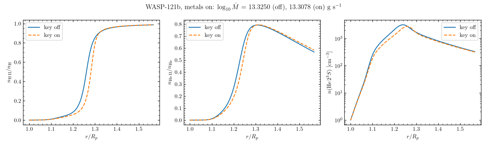

# A certified metal-bearing state with the ionization stages transported (2026-09-19)

PLAN_20260918_rev2 item D9, step 3. Every number below is MEASURED on
2026-09-19 with a scratch copy of the tree's `EXHALE.x` (md5
`7670f31031fb4db91d27b44cb0da6f70`), 8 threads on lart4, unless it is marked
READ. The source was not touched.

## 1. Verdict

**CERTIFIED at outer pass 29 of 90, on the first route.** WASP-121b with
He 2^3S and solar trace metals, `Ionization transport: True`, solved by the
partitioned stationary route from the certified key-off state of
`wasp_full_newton`: `CERTIFIED: every active equation was evaluated and is
within its tolerance` (`cert_reason=certified_in_wind`), the stationary solve
returned `info = 0`. The transported stage sources equal the local sweep's
rows at every one of the 500 cells, difference exactly 0. The key moves
log10 Mdot from 13.3250 to 13.3078 g/s and shifts the H and He ionization
fronts outward by about 0.01 to 0.02 R_p (read from the figure of section 5).

## 2. The seed and why

`backup/regression/wasp_full_newton/IC/`: READ from its `README.md` and its
header, the certified Newton state of the 2026-09-16 golden refresh
(`certified=T`, `sec_ion_step=2429`, `iontrans=F`, `wellbal=F`,
`He23S=T metals=T`), 500 cells from 1.0002 to 1.5666 R_p. It is metal-bearing,
already stationary with the key off, and its He 2^3S triplet system with metals
(`System_HeH_TR_metals`) is the one whose metal charge exchange D7b moved into
the transported stage sources (group A with hydrogen, group E with helium). It
is the same planet and configuration as `wasp_full`, whose key-on solve D7b
found refused because that case is a 400-step relaxation snapshot; this seed
removes exactly that cause. The planet folders were not needed once a pinned
certified metal-bearing pair was found in the regression tree.

## 3. Route 1 (the only one run): key-on from the certified key-off state

Input: `wasp_full_newton/input.inp` and `metals.inp`, with `Load IC? True`,
the stage-2 `du_th` set to 10 (no march before the solve, as in
`carrier_model_a_newton`), and appended: `Ionization transport: True`,
`Restart intent: stationary`, `Solver: Newton 100.0`, `Resid tol: 1.0e-8`,
`Coupled carrier solve: False`, `Well balanced: True`,
`Secondary_ionization: Immediate`, `Restart option change: iontrans, wellbal`
(the seed carries `wellbal=F`, so the well-balanced option is a second option
change). Environment: `EXHALE_PTC_DTAU0=1.0`, `EXHALE_OUTER_PASSES=90` (the
`transported_ionization` budget of D9), `OMP_NUM_THREADS=8`. Wall time about
5 minutes (passes of 1.5 to 11.5 s each).

Pass table (every pass at `hydro info=0`; rows are the gated measures, the
carrier gate is 1.0e-5 at r >= 1.20 R_p):

| pass | hydro info | worst gated species row | cell | row | mass | momentum | energy |
|---:|---:|---:|---:|---|---:|---:|---:|
| 1 | 0 | 3.05E-02 | 382 | `carrier balance H+` | 1.10E-12 | 3.47E-10 | 1.17E-10 |
| 2 | 0 | 3.00E-02 | 383 | `carrier balance H+` | 8.11E-13 | 3.55E-10 | 8.63E-11 |
| 3 | 0 | 2.94E-02 | 383 | `carrier balance H+` | 7.12E-13 | 3.11E-10 | 7.58E-11 |
| 4 | 0 | 2.87E-02 | 383 | `carrier balance H+` | 6.59E-13 | 2.87E-10 | 7.03E-11 |
| 5 | 0 | 2.79E-02 | 384 | `carrier balance H+` | 5.88E-13 | 2.55E-10 | 6.30E-11 |
| 6 | 0 | 2.70E-02 | 384 | `carrier balance H+` | 5.68E-13 | 2.45E-10 | 6.10E-11 |
| 7 | 0 | 2.59E-02 | 384 | `carrier balance H+` | 5.36E-13 | 2.30E-10 | 5.76E-11 |
| 8 | 0 | 2.47E-02 | 385 | `carrier balance H+` | 5.14E-13 | 2.20E-10 | 5.54E-11 |
| 9 | 0 | 2.34E-02 | 385 | `carrier balance H+` | 4.89E-13 | 2.08E-10 | 5.30E-11 |
| 10 | 0 | 2.20E-02 | 385 | `carrier balance H+` | 4.83E-13 | 2.06E-10 | 5.23E-11 |
| 11 | 0 | 2.05E-02 | 385 | `carrier balance H+` | 4.67E-13 | 1.98E-10 | 5.08E-11 |
| 12 | 0 | 1.88E-02 | 385 | `carrier balance H+` | 4.51E-13 | 1.91E-10 | 4.91E-11 |
| 13 | 0 | 1.71E-02 | 385 | `carrier balance H+` | 4.40E-13 | 1.87E-10 | 4.80E-11 |
| 14 | 0 | 1.53E-02 | 385 | `carrier balance H+` | 4.34E-13 | 1.85E-10 | 4.75E-11 |
| 15 | 0 | 1.34E-02 | 384 | `carrier balance H+` | 4.25E-13 | 1.81E-10 | 4.66E-11 |
| 16 | 0 | 1.14E-02 | 383 | `carrier balance H+` | 4.33E-13 | 1.84E-10 | 4.74E-11 |
| 17 | 0 | 9.38E-03 | 382 | `carrier balance H+` | 4.40E-13 | 1.86E-10 | 4.84E-11 |
| 18 | 0 | 7.22E-03 | 380 | `carrier balance H+` | 4.76E-13 | 2.00E-10 | 5.23E-11 |
| 19 | 0 | 4.92E-03 | 378 | `carrier balance H+` | 5.63E-13 | 2.35E-10 | 6.19E-11 |
| 20 | 0 | 2.31E-03 | 372 | `carrier balance H+` | 7.64E-13 | 3.14E-10 | 8.36E-11 |
| 21 | 0 | 1.11E-03 | 353 | `carrier balance He++` | 8.57E-13 | 2.61E-10 | 9.14E-11 |
| 22 | 0 | 2.23E-03 | 401 | `carrier balance He++` | 8.74E-13 | 2.68E-10 | 9.43E-11 |
| 23 | 0 | 1.24E-03 | 399 | `carrier balance He++` | 4.15E-13 | 1.67E-10 | 4.61E-11 |
| 24 | 0 | 1.66E-04 | 412 | `carrier balance He++` | 2.01E-13 | 6.21E-11 | 2.18E-11 |
| 25 | 0 | 1.81E-04 | 402 | `carrier balance He++` | 2.38E-12 | 7.52E-10 | 2.64E-10 |
| 26 | 0 | 3.79E-05 | 398 | `carrier balance He++` | 1.09E-13 | 2.51E-11 | 1.41E-11 |
| 27 | 0 | 4.62E-05 | 402 | `carrier balance He++` | 2.14E-12 | 6.77E-10 | 2.38E-10 |
| 28 | 0 | 2.73E-05 | 399 | `carrier balance He++` | 1.58E-12 | 4.98E-10 | 1.75E-10 |
| 29 | 0 | 4.00E-06 | 411 | `carrier balance He++` | 3.24E-13 | 8.84E-11 | 3.09E-11 |

Pass 29: `ACCEPTED -- every active equation of this state is within its own
tolerance.` The binding cell sits in the H ionization front (cells 382 to 385,
r about 1.25 R_p) for 20 passes while the measure falls, then the He++ row
takes over and falls below the gate.

Final certification of the written state:

| entry | max (all cells) | cell | gated at r >= 1.20 | verdict |
|---|---:|---:|---|---|
| hydrodynamic mass | 3.239e-13 | 239 | tol 3.0e-12 | within |
| hydrodynamic momentum | 8.841e-11 | 499 | tol 1.0e-8 | within |
| hydrodynamic energy | 3.091e-11 | 499 | tol 1.0e-6 | within |
| carrier balance H+ | 1.458e-04 | 4 | 1.040e-06 at 404 | within |
| carrier balance He+ | 2.164e-05 | 122 | 7.011e-07 at 382 | within |
| carrier balance He++ | 2.155e-05 | 26 | 4.000e-06 at 411 | within |
| ionization stage nucleus sum H / He | 2.145e-16 / 2.040e-16 | 500 / 389 | | within |
| level balance He 2^3S | 6.139e-21 | 396 | | within |
| level balance H(n=2) | 3.059e-15 | 475 | | within |
| eliminated-species closure System_HeH_TR_metals | 4.572e-14 | 446 | | within |

The carrier maxima above the gate sit below 1.20 R_p (cells 4, 122, 26),
where the species rows are reported and do not gate. Flux gate as written:
5.3618e-13.

No second or third route was needed.

## 4. The identity on the solved column

`solved_state_sources.x` of D7b (scratch `D7b/solved_state_sources.f90`,
linked 2026-09-18 17:53 against objects built after the last change to
`src/modules/radiation/charge_exchange.f90`, 17:06 that day), run on the
written key-on state: maximum absolute difference between the sweep row source
and the transported stage source over the 500 cells is 0.000e+00 for H II
(scale 2.919e+05 cm^-3 s^-1), 0.000e+00 for He II (scale 5.006e+01) and
0.000e+00 for He III.

## 5. Movement against the key-off state

Key-off control: the same seed, the same keys with `Ionization transport:
False` and `Restart option change: wellbal`, the same binary. One stationary
solve, `info=0`, CERTIFIED, flux gate 2.3454e-12. (So both states carry the
well-balanced option; the seed itself was certified without it on an older
binary and is not the comparison.)

| quantity | key off | key on |
|---|---:|---:|
| log10 Mdot [g/s] (`exhale_io.mdot_log10`, equilibrium files) | 13.3250 | 13.3078 |
| n(H II)/n(H) at the outer cell | 0.98685 | 0.98741 |
| n(He II)/n(He) at the outer cell | 0.56697 | 0.58309 |
| n(He 2^3S) at the outer cell [cm^-3] | 326.5 | 315.3 |
| largest relative change of n(H II)/n(H) | 0.549 at r = 1.2555 | |
| largest relative change of n(He II)/n(He) | 0.300 at r = 1.2119 | |
| largest relative change of n(He 2^3S) | 0.373 at r = 1.2074 | |

`figures/iontrans_metals_movement_20260919.png` (script kept in the D9ref scratch
as `iontrans_metals_movement.py`). Advection of the stages carries neutral gas
outward before it is ionized, so both fronts move out; the largest relative
changes are in the steep part of the fronts, not a change in the asymptotic
state. The He 10830 transit depth was NOT computed: the stationary route writes
no `*_adv.txt` profiles, which `EXHALE_transit.py` reads; the He 2^3S density
profile is shown instead.

## 6. The regression case

`backup/regression/iontrans_metals/`: `input.inp` (the route-1 input),
`metals.inp`, `IC/` with the unchanged `wasp_full_newton/IC` pair (the harness
copies `IC/*_IC.txt` into `output/` before each run, so the pair lives in `IC/`,
as for `carrier_model_a_newton`), `run.sh`, `NOTE.txt`; no `maxsteps`
(stationary solve). No golden was written.

The default outer pass cap of `EXHALE_main.f90` is 20 (READ, line 499) and
this case accepts at pass 29, while `run_check.sh` sets no pass cap; it passes
the caller's environment through, so the case must be checked as
`EXHALE_OUTER_PASSES=90 run_check.sh check iontrans_metals`. Whether that
belongs in the harness (or in a file in the case directory, as `maxsteps` is) is the
advisor's decision.

The harness run (MEASURED, 2026-09-19):
`EXHALE_OUTER_PASSES=90 REGRESSION_EXE=<scratch copy of EXHALE.x> run_check.sh check iontrans_metals`
skipped the build, ran the case single-threaded, which accepted at outer pass
29 with `info = 0`, and reported `NO VERDICT` (no reference in `golden/`). Its
`Hydro_ioniz.txt` and `Ion_species.txt` data lines are byte-identical to those
of the 8-thread route-1 run, and so is a single-threaded run of `run.sh` in a
scratch copy. Two things the advisor will meet when the golden is snapshotted:
the stationary route writes no `*_adv.txt` pair, so those two entries of the
harness's `FILES` stay `MISS` for this case; and the harness's summary line
greps `final:`, which this route does not print, so that line is empty.
