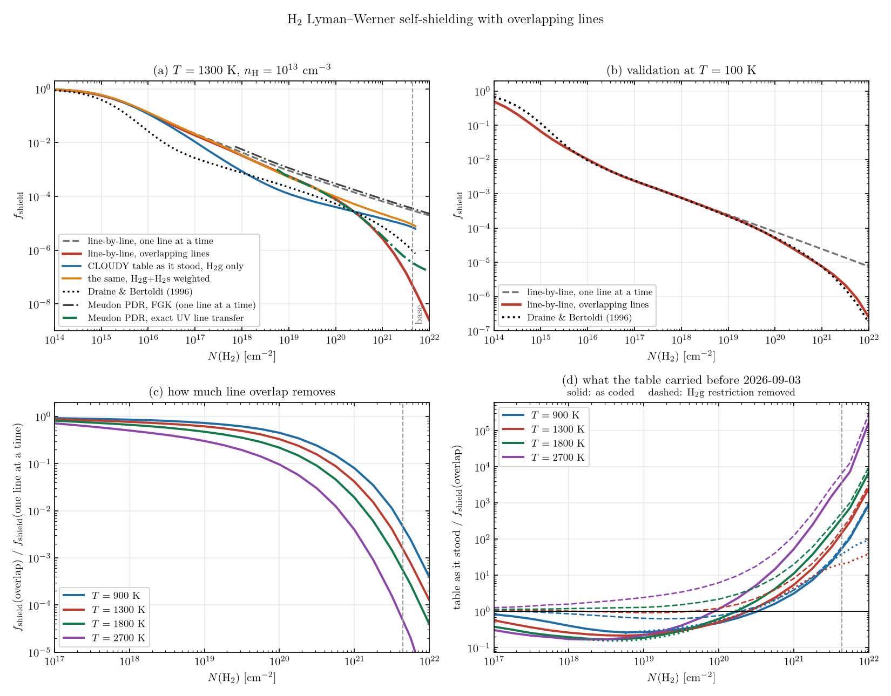

# H2 Lyman-Werner self-shielding with overlapping lines

*2026-09-03. `TO_BE_DONE.md` item P38, the open question left by
`docs/Update_EXHALE_stage1.md` section 122 and `docs/h2_self_shielding_cloudy.md`
section 11.2.*


> **Status, 2026-09-03: both findings of this note have been acted on.** The
> table in `src/modules/lower_atmosphere/h2_self_shielding_table.f90` is now
> built from the overlapping-line calculation of section 4 and is a rate for
> all H2 rather than for CLOUDY's H2g sub-reservoir;
> `h2_shielding_overlap_column` is gone. `Update_EXHALE_stage1.md` section 135 is the
> changelog entry and carries the verification. Sections 1-5 below are the
> measurement as it was made, and stand; section 6 records what was done with
> it.

---

## 1. The judgement

**Two separate errors sit in the H2 Lyman-Werner rate the tree carries, they
push in opposite directions, and they cross near `N_H2 = 2e20 cm^-2`.**

**(1) The tabulated rate belongs to the wrong set of molecules.** The CLOUDY
quantity section 122 tabulated, `Shield(H2)`, is
`Solomon_dissoc_rate_g/G(TH85)` -- the dissociation rate of the **H2g**
sub-reservoir alone (`v = 0, J <= 8`, everything below `ENERGY_H2_STAR =
4100 cm^-1`), which CLOUDY's chemistry uses beside a separate H2s reservoir
with its own rate. The code applies it to all H2. The H2s lines start from
levels 100-1000 times less populated, stay unsaturated far deeper, and by
`N_H2 = 1e19` their dissociation rate per molecule is 165 (1300 K) to 615
(900 K) times the H2g one. **Weighting the two by the LTE populations makes the
CLOUDY curve agree with an independent line-by-line calculation to 1-4 per cent
up to `N_H2 = 1e17` and to 30-80 per cent at `1e18-1e19`, against 2-18x
before.** That is the whole of the 5-9x this note first reported as
unresolved, and section 5.4 is the decomposition.

**(2) Line overlap is missing, and at our columns it is the dominant term.**
Two calculations that differ only in whether the H2 lines absorb each other's
beam differ by 24x at `N_H2 = 1e21` and by 630x at the `4.4e21` of the
molecular base, at 1300 K. This is what the Meudon PDR code with its exact UV
line transfer and the line-by-line calculation both say, agreeing with each
other to 5-22 per cent.

**Net effect on the coded rate.** Error (1) makes `f_shield` too small, error
(2) makes it too large. With (1) corrected and (2) still missing, the table
would stand above the overlapping-line answer by

| N(H2) [cm^-2] | 900 K | 1300 K | 1800 K | 2700 K |
|---|---|---|---|---|
| 1.0e+19 | 0.6 | 0.9 | 1.2 | 1.8 |
| 1.0e+20 | 0.8 | 1.2 | 1.8 | 3.8 |
| 3.2e+20 | 1.3 | 2.1 | 3.3 | 8.2 |
| 1.0e+21 | 3.8 | 6.3 | 9.1 | 24 |
| 4.4e+21 | 62 | 43 | 43 | 201 |

i.e. **fixing (1) alone would leave the table right to within a factor 2 below
`N_H2 = 3e20` and wrong only by the overlap above it.** As the table stands,
the two errors partly cancel below `1e20` -- which is why nobody saw either --
and both the sign and the size of the residual are temperature-dependent.

**The absolute cross section of section 132 is safe at the illuminated face
and not at depth.** `sigma_diss`, `p_single` and `p_eff` are all H2g
quantities, but at `N_H2 -> 0` the H2s correction is +0.01 per cent at 700 K
rising to +11 per cent at 3200 K, so the 0.5 per cent check against Draine &
Bertoldi's Table 1-2 normalization -- which was made at 100 K, where `x(H2s)`
is zero -- stands. Section 5.5.

**Four calculations, and what each one is worth.**

| | line overlap | agrees with |
|---|---|---|
| **Meudon PDR, `f_ShieldAlgo = 1`** (Le Petit et al. 2006 sec. 4.3) | yes | the line-by-line overlap branch to 5-22% over `1e19-1e21` |
| **line-by-line** (section 4, written for this item) | either branch | Draine & Bertoldi (1996) at 100 K to 2-9% |
| **Meudon PDR, `f_ShieldAlgo = 0`** (FGK, sec. 4.4) | no | the line-by-line no-overlap branch to 15-35%, at 100 K and at 1300 K |
| **the CLOUDY table now in the code** | no | the line-by-line no-overlap branch to 1-4% below `1e17` **once the H2g restriction is undone**; 2.5-3.0x low above `1e20`, which is the size of the spread among CLOUDY's own shielding-function options |

**No code was changed.** Section 6 states what a change would have to be.

---

## 2. What had to be true for the Meudon PDR code to be usable, and what was not

The Meudon PDR code is an interstellar code. Our conditions -- `n_H = 1e13
cm^-3`, `G_0 = 1.5e6`, no dust, no metals, fixed `T` up to 2700 K -- are far
outside the range its published grids cover (Le Petit et al. 2006 section 9
runs `n_H <= 1e7 cm^-3` and `chi <= 1e7`). Each item below was checked by
running, not by reading.

### 2.1 Build

Not built in the delivered tree. **A copy was made into the scratch directory
and built there; the original tree was not written to.**

```
cp -a ~/RT_Codes/PDR71_260706 <scratch>/PDR71
cd <scratch>/PDR71/src && make PDR          # gfortran 13.1.0, -O3
```

`make` links `-llapack -lblas`, both present as
`/usr/lib/x86_64-linux-gnu/liblapack.so`, `libblas.so`. The link step warns
`libgfortran.so.4, needed by liblapack.so, may conflict with libgfortran.so.5`;
the binary runs. **`make -j` fails** -- the makefile carries no module
dependency rules, so the objects must be built in the listed order; a serial
`make` succeeds. **A parameter change forces `make clean`** for the same
reason: nothing is rebuilt on a changed `.mod`.

### 2.2 Two edits to the copy, both outside the physics

* `PXDR_02_CONSTANTES.f90:208`, `python_version = '~/.ismpy/bin/python3'`. The
  code calls this interpreter to convert its ASCII output to HDF5 and **stops
  with `*** Error: ismpy is not found on the computer` when it is absent**,
  which it is on this machine. Changed to `python3` (the system interpreter,
  h5py 3.16.0, numpy 1.26.4 -- no environment was created).
* `PXDR_26_OUTPUT_ASCII.f90:80,116,152`, `sh_cmd = "rm -r "` -> `"true  "`, so
  the ASCII tables the HDF5 file is built from survive the run. The analysis
  here reads those.

### 2.3 The conditions that can be expressed

| our condition | how it is set | verified |
|---|---|---|
| `n_H = 1e13 cm^-3` | `f_StateEquation 0`, `ProtDensity 1e13` | runs; no array limit hit |
| fixed `T` | `f_ThermBalance 0`, `Tgas` | `T` constant through the slab in the output |
| thermal `b`, no turbulence | `vturb 0.0` | Meudon's Doppler width is `sqrt(2kT/m + v_turb^2)` (Le Petit et al. 2006 section 4.3), i.e. `b = sqrt(2kT/m_H2)`, the same definition as `h2_doppler_parameter` |
| flat `F_lambda`, `F(912-1110 A) = 343 erg cm^-2 s^-1` | `ISRF_Shape I_flatFlam.txt`, `ISRF_Geom beam_isot`, `G0_ObsSide 1.5356e6` | section 2.5 |
| one-sided illumination | `beam_isot` | the back side must carry `G0_BackSide >= 4e-2`; at the deepest point that is 0.4% of the shielded front field |
| no metals | `metallicity 1e-6` | C, N, O, S, Si, Fe abundances 1e-6 solar in the output |
| no dust | `metallicity 1e-6` | dust `A_V` through the whole slab is `5e-5` mag, i.e. `tau_UV ~ 1e-4` |

### 2.4 The conditions that cannot, and what was done instead

* **`A_V` is the code's depth coordinate, and it has a hard floor.**
  `AV_edge = 1.0e-6` (`PXDR_02_CONSTANTES.f90:145`) is both the first grid
  point and the depth below which `Remove_Spatial_Edge_Points` flattens the
  abundance profile; `Build_SpatialGrid` refuses `AVmax` below it outright
  ("Modelling a slab smaller than AV = ... is not currently possible"). A
  dust-free slab has `A_V -> 0`: at `metallicity 1e-6` the column we need,
  `N_H ~ 1e23`, is `A_V = 5e-5` mag, only 50 times the floor. **A first
  attempt at `AVmax = 1e-5` segfaulted** in `Remove_Spatial_Edge_Points`
  (`PXDR_27_UPDATE_ITERATION.f90:1075`, `j` never set because the forward
  search for `tau >= AV_edge/tautav` found nothing). `AVmax = 5e-5` runs.
  The cost is that **the profile below `A_V = 1e-6`, i.e. below
  `N_H2 ~ 6e18 cm^-2`, is flattened by the code and is not usable**; the
  Meudon curves here start at `1e19`.
* **Dust and metals cannot be removed separately from the depth scale.**
  `cdunit = cdunit_0/metallicity` sets `N_H = A_V x cdunit/R_V`
  (`PXDR_22_INITIALISATION.f90:641,645`) while the grain opacity per proton is
  scaled by the same `metallicity` (`PXDR_12_DUSTEM.f90:1179`). Both scale
  linearly, so `metallicity` is the single knob for "how optically thin is the
  dust", and it drags the elemental abundances (`PXDR_11_READCHIM.f90:209`,
  which skips H, He and D) and the grain-surface H2 formation rate
  (`PXDR_18_CHEMISTRY.f90:286`, `g_ratio/0.01`) with it.
* **The molecular slab exists only below about 1500 K.** At `n_H = 1e13
  cm^-3` the Meudon network's collisional dissociation (Glover & Mac Low 2007,
  the code's default `F_H2_COLL_D = 1`) removes H2 faster than anything in the
  network replaces it once the gas is warm. Measured, as the fraction of
  hydrogen in H2 through the whole slab: **0.998 at 900 K, 0.997 at 1300 K,
  0.0046 at 1800 K, 5e-5 at 2700 K.** The consequence is the range of columns
  each run reaches: `N_H2` at the back of the same `A_V = 5e-5` slab is 4.7e22
  at 900 and 1300 K, 2.2e20 at 1800 K and 5.0e16 at 2700 K. **So the Meudon
  side of this note covers 900 and 1300 K over the full column range, 1800 K
  only up to `1e20 cm^-2`, and 2700 K not at all.** The line-by-line
  calculation of section 4 has no chemistry in it and covers all four.
* **The network also has no three-body H2 formation**, which is the channel
  that keeps a real base at `n_H = 1e13` molecular. A copy of the chemistry
  file with the grain formation coefficient raised by 1e8 (`OLDST h h h2`,
  `3.00E-17 -> 3.00E-09`, `ch240706_hhe_fastH2.chi`) was made to test whether
  that is what limits the runs. **It is not: the 1300 K run is identical with
  and without it** -- same 440 grid points, same `N_H2` profile to all digits,
  same face rate `6.851934e-05 s^-1`. H2 here is made in the gas phase, not on
  grains, and it is already at its chemical-equilibrium value, so the
  formation rate is not a free knob and none of the numbers below rest on one.
  It is also why the 1800 and 2700 K runs cannot be pushed further: what stops
  them is destruction, not formation.

### 2.5 The radiation field, and the `G_0` that reproduces our band flux

Le Petit et al. (2006) Appendix C: *"We take the Habing standard value as
5.6 x 10^-14 ergs cm^-3 between 912 and 2400 A"*, then *"Here we define the
radiation scaling factor at some point by"* the displayed integral of
`u(lambda)` over that interval divided by that constant, and *"The 'usual' G_0
parameter is taken as the value of G without cloud (in free space)."*
(Superscripts and the Angstrom sign are written out here; the sentences are
otherwise the published wording.) The code carries exactly those two constants (`u0_Habing = 5.6e-14`,
`wl_Hab = 2400`, `PXDR_02_CONSTANTES.f90:109,111`). **This is not the Habing
band of `docs/h2_self_shielding_cloudy.md` section 2.2** (6-13.6 eV,
912-2066 A); Le Petit et al. say so themselves -- *"Note that this cutoff
corresponds to 5.166 eV, whereas it is often given as 6 eV. Although small,
this difference is one among the many inconsistencies between various codes."*

For a flat `F_lambda` beam normalized to `F(912-1110 A) = 343 erg cm^-2 s^-1`,
`F_lambda = 343/198 = 1.7323 erg cm^-2 s^-1 A^-1`, so
`F(911.75-2400 A) = 2578 erg cm^-2 s^-1`, `u = F/c = 8.599e-8 erg cm^-3` and

    G_0(Meudon definition) = 8.599e-8 / 5.6e-14 = 1.5356e6 .

The shape is supplied as `data/Astrodata/I_flatFlam.txt` (the code takes any
file whose name begins with `I_`), flat in `F_lambda` from 900 to 2400 A and
falling as `lambda^-4` beyond so that the visible and infrared come from the
code's own Mathis components rather than from an unphysical flat extension.

**The normalization was checked against the rate, not against the file.** The
unattenuated H2 photodissociation probability the code reports at 1300 K is
`8.802e-5 s^-1`. `lyman_werner.f90` gives `sigma_lw F/<hv> = 6.03e-5 s^-1` for
the same band flux, and the CLOUDY runs of section 122 gave 1.34x the module
(`docs/h2_self_shielding_cloudy.md` section 8). Meudon is 1.46x the module.
**The three unattenuated rates agree to 30 per cent**, which is the level at
which the H2 line data and band definitions of three codes can be expected to
agree, and it says the field normalization is right.

---

## 3. What the Meudon PDR code does about line overlap, from the published paper

The option is `f_ShieldAlgo` in the input file: *"0: FGK approximation, 1:
Radiative transfer equation fully solved in UV lines"*, with the set of lines
chosen in `data/flags_UVLineTransfer.conf`. **The default in the delivered
`data/pdr.in` is `0`, the FGK approximation** -- the same one-line-at-a-time
physics CLOUDY uses, and therefore not the thing P38 needs. The runs here use
`1`.

**Section 4.3, "UV Discrete Absorption", is where the overlap enters.** For
each line included in the transfer the code adds an opacity
`kappa_{l->u} = (sqrt(pi) e^2 / m c Delta_nu_D) n_l f_lu H(a_lu, nu)` with the
Voigt function `H(a, nu)`, `a = Gamma/(4 pi Delta_nu_D)`, and
`Delta_nu_D = (nu_0/c)(2kT_K/m + v_turb^2)^(1/2)`; these opacities are summed
into the total gas absorption coefficient `kappa^G_lambda` that enters the
transfer equation through `d tau_lambda = ds (kappa^G_lambda + kappa^D_lambda
+ sigma_lambda)`, solved as eq. (1)-(2) by the spherical-harmonics method of
Flannery et al. (1980) and Roberge (1983). Overlap is not a term that was
added; it is what summing the opacities on one wavelength grid means. The
paper says so where it discusses cost: *"Adding more and more lines does not
lead to a simple scaling between the number of lines and the computing time.
CPU time is proportional to the number of points in the wavelength grid, and
line overlap tends to limit its growth as the number of lines increases."*
And on why the contributions are not windowed line by line: *"Various tests have shown that it
is faster to compute the contribution of all lines at all wavelengths than to
try and devise position and wavelength-dependent tests to include only
significant contributions."*

**The code matches that description.** `PXDR_09_RF_TOOLS.f90` builds
`g_absL(j,n)` -- absorption coefficient at wavelength index `j`, depth `n` --
by looping over H (line 1637), D (1690), H2 (1729) and HD, evaluating
`CALL VOIGT_PFL` for each line and *accumulating* into the same array;
`PXDR_14_TRANSFER_N.f90:451` then forms `alp_gas = g_absL/(kap_dus+sca_dus)`
for the transfer. The pumping rate of each line, `shih2U(n,k)`, is the
integral of that solved field over the line's own Voigt profile
(`PXDR_09_RF_TOOLS.f90:1765-1769`). Nothing anywhere isolates one line.

**Section 4.4, "Other Lines", is the limit of that treatment.** *"The H2 lines
above the threshold mentioned in the previous paragraph and the CO
predissociating lines ... are not included in the complete radiative transfer
described above. We compute self-shielding effects by using the approximation
of Federman et al. (1979, hereafter the FGK approximation)."* -- with the
qualification that *"absorption is computed using the local (A_V-dependent)
radiation field, which includes absorption by H2 strong lines"*, so even the
FGK-treated lines see the strong lines' absorption in the continuum, though
not each other's.

**The threshold, and how the paper's wording maps onto PDR 7.1.** Le Petit et
al. write that the set *"is determined from the value of the rotational
quantum number of the lower level of the UV transition"*, and quote CPU ratios
of *"1 : 10 : 50"* for no lines, `J = 0, 1`, and `J = 0` to `3`. **In PDR 7.1
the threshold is an index into the energy-ordered H2 level list, not `J`**:
`flags_UVLineTransfer.conf` has one integer per species (`h2 20` as delivered),
read into `l_trc_h2` (`PXDR_22_INITIALISATION.f90:933`) and applied as
`IF (lev > l_trc_h2) CYCLE` (`PXDR_15_RF_INIT.f90:1001`). Level 20 of
`data/Levels/level_h2.dat` is `(v=1, J=7)` at `E/k = 10341 K`. **The runs here
use `h2 30`** -- `(v=2, J=5)`, `E/k = 13890 K` -- which in LTE holds 99.994%
of the H2 at 1300 K and 98.2% at 2700 K, so the FGK remainder of section 4.4
carries at most 2% of the absorbers.

**One thing the paper does not say and the code does.** The exact treatment is
armed only from the fifth global iteration: `IF (irah2U(i,5) == 0 .OR. ifaf <=
4)` selects the FGK branch (`PXDR_17_FGK_TR.f90:270`). A run with
`NbIteration <= 4` is an FGK run whatever `f_ShieldAlgo` says. All exact runs
here use `NbIteration 20`, which is also what the input file's own comment
requires ("must be > 10 to correctly solve the level populations").

**Excitation.** `data/flags_SpeciesExcitation.conf` carries `h2 302`, all 302
rovibrational levels of the ground state, matching Table 5 note a: *"All
rovibrational levels of H2 ground electronic state may be included. Usually,
they are included up to a highest level (l_0) chosen on physical ground."*
The populations that come out at `n_H = 1e13` are LTE to five digits
(section 5.1), which is the regime the comparison needs.

**The paper's own FGK-versus-exact test, section 8.5.** *"We checked the
validity of the FGK approximation for the model n_H = 100 cm^-3 and chi = 1,
A_V = 1 by solving the full radiative transfer as described in section 4 up to
J = 5. The photodissociation probabilities of H2, HD, and CO and
photoionization probabilities of C and S are the same at the edge of the cloud
(Table 7) in the two treatments. However, the values differ significantly at
A_V greater than 0.05."* That is at `n_H = 100 cm^-3` and `A_V = 1`, i.e. at
`N_H2` five decades below ours; the discrepancy can only grow with column.

---

## 4. The line-by-line calculation

Because the two codes disagreed with each other by an order of magnitude in
their *one-line-at-a-time* branches (section 1), a third calculation was
written that is simple enough to be checked end to end.

### 4.1 What it is

`lbl.py` in the scratch directory. It reads only data files:

* `data/Levels/level_h2.dat` -- the 302 rovibrational levels of X, with `g`
  and `E/k`;
* `data/Levels/lev_H2_{B,Cp,Cm,Bp,Dp,Dm}.dat` -- the six excited electronic
  states, with the total decay rate `Gamma` and the dissociation probability
  per excitation of every upper level;
* `data/UVdata/UV_H2_{...}.dat` -- 36 427 Lyman and Werner transitions with
  `A_ul` and the transition wavenumber.

These are the Abgrall, Roueff & Drira (2000) data the Meudon code itself uses.
Level populations are LTE at the imposed `T` (justified in section 5.1);
`f_lu = A_ul (2J_u+1)/(2J_l+1) lambda_A^2 / 6.6702e15`; the profile is a Voigt
with `b = sqrt(2kT/m_H2)` and `a = Gamma/(4 pi Delta_nu_D)`, evaluated with
`scipy.special.wofz` inside +-300 Doppler widths and as the exact Lorentzian
outside it, on 4e5 points from 912 to 1110 A (or 1200 A, section 4.4).

The slab is a normally incident beam, flat in `F_lambda`:

    tau(nu, N) = N sum_i x_i sigma_i(nu)                 (overlapping lines)
    tau_i(nu, N) = N x_i sigma_i(nu)                     (one line at a time)
    k_diss(N) = sum_i x_i (pi e^2/m c) f_i p_diss,i int phi_i(nu) F_nu e^-tau /(h nu) dnu

and `f_shield(N) = k_diss(N)/k_diss(0)`. The two branches differ in one
expression and nothing else, which is the point: their ratio is the overlap
effect with no other difference to argue about.

### 4.2 What it is not

No scattering, no dust, no continuum absorber, no re-emission, no H Lyman
lines, no non-LTE. Those omissions bias the answer in one direction only:
every one of them would add absorption inside the band, so the overlapping-line
`f_shield` quoted here is itself an upper bound.

### 4.3 The validation, at 100 K against Draine & Bertoldi (1996)

Draine & Bertoldi's fit was built from a calculation that *includes* line
overlap -- their section 5.2 describes *"the rapid falloff due to line overlap
for N2 > 1e20 cm^-2"* -- for cold gas, where the population sits in `J = 0, 1`.
That is the one published overlap-including curve available to check against.

| `N_H2` [cm^-2] | overlapping lines | one line at a time | DB96 | ratio to DB96 |
|---|---|---|---|---|
| 1.0e+16 | 1.016e-02 | 1.017e-02 | 9.429e-03 | 1.08 |
| 1.0e+17 | 2.389e-03 | 2.413e-03 | 2.459e-03 | 0.97 |
| 1.0e+18 | 7.673e-04 | 7.816e-04 | 7.534e-04 | 1.02 |
| 1.0e+19 | 2.280e-04 | 2.449e-04 | 2.195e-04 | 1.04 |
| 1.0e+20 | 5.128e-05 | 7.792e-05 | 5.351e-05 | 0.96 |
| 1.0e+21 | 7.623e-06 | 2.454e-05 | 7.439e-06 | 1.02 |
| 4.4e+21 | 1.365e-06 | 1.159e-05 | 9.479e-07 | 1.44 |

**The overlapping-line branch reproduces DB96 to 2-8 per cent from 1e16 to
1e21 cm^-2**, and the one-line-at-a-time branch departs from it exactly where
DB96 say overlap sets in, reaching 3.3x at 1e21 and 12x at 4.4e21. That is a
two-sided check: it validates the line data, the populations, the profile
integral and the slab attenuation, *and* it confirms that DB96's fit carries
overlap while a calculation that shields one line at a time does not.

**The same table read against CLOUDY.** `docs/h2_self_shielding_cloudy.md`
section 3 reports `DB96/CLOUDY = 2.27-3.38` over `1e17 <= N_H2 <= 5e20` at
100 K. CLOUDY shields one line at a time, so at 100 K it should sit *above*
DB96 by the 1.02-1.3x of the table's third column, not a factor 2-3 below it.
**That is the H2g restriction of section 5.4 showing up at 100 K as well**:
there `x(H2s)` is zero to five digits in LTE, but the 100 K control of
section 3 was run at `n_H = 1e4 cm^-3` and `G_0 = 1.25e-3`, where the
populations are UV-pumped rather than thermal and H2s is populated by the
pumping itself. The size and sign match what section 5.4 measures at our own
conditions.



*Panel (a): the four curves at 1300 K. Panel (b): the 100 K validation of the
table above -- the overlapping-line curve lies on Draine & Bertoldi. Panel
(c): the overlap suppression, `f_shield`(overlap)/`f_shield`(one line at a
time); filled circles mark `h2_shielding_overlap_column` of the table now in
the code. Panel (d): the table now in the code divided by the
overlapping-line answer.*

### 4.4 What the deep values depend on

Three sensitivities were measured at 1300 K, at the columns where the answer
is smallest and therefore least robust (`f_shield` at
`N_H2 = 1e19 / 1e20 / 1e21 / 4.4e21`):

| variation | overlapping lines | one line at a time |
|---|---|---|
| reference: `<= 1200 A`, 4e5 grid points, lines to 1-1e-6 of the rate | 5.83e-4, 8.51e-5, 3.56e-6, 2.22e-7 | 9.28e-4, 2.45e-4, 6.60e-5, 2.98e-5 |
| 1.2e6 grid points | 5.83e-4, 8.51e-5, 3.56e-6, 2.22e-7 | unchanged |
| lines to 1-1e-7 of the rate | 5.77e-4, 8.35e-5, 3.54e-6, 2.78e-7 | 9.29e-4, 2.46e-4, 6.68e-5, 3.04e-5 |
| band restricted to `<= 1110 A` | 5.67e-4, 8.12e-5, 2.89e-6, 6.05e-8 | 9.11e-4, 2.40e-4, 6.49e-5, 2.94e-5 |

* **Wavelength resolution is converged**: tripling the grid changes nothing.
* **The line set matters only at the base column**, where 25 per cent of the
  surviving pumping comes from lines carrying less than 1e-6 of the
  unattenuated rate. Everything at `N_H2 <= 1e21` is stable to 3 per cent.
* **The band definition matters a great deal at the base column and almost
  nowhere else.** Between 1110 and 1200 A the H2 opacity is sparse, so at
  `4.4e21` the surviving pumping is dominated by that region and the answer
  moves by 3.7x; below `1e21` the shift is under 20 per cent, and the
  unattenuated rate is unaffected to five digits (`6.8045e-5` vs `6.8048e-5`
  s^-1). **The tables below use `912-1110 A`**, EXHALE's own band at the time
  of this memo, because `sigma_lw` was calibrated to the flux in it; a rate
  that also counted the 1110-1200 A pumping would have to count that flux too.
  The consequence is that the base-column numbers carry a factor of a few,
  which is why section 1 quotes orders of magnitude and not digits.

  **Resolved on 2026-09-06 (item LW-NORM-B), in the other direction: the flux
  is counted too.** EXHALE's Lyman-Werner band is now 912-1201 A, the interval
  the line list occupies, and the shipped table is normalized per photon of
  it; the incident-flux key `Stellar LW flux` states the same interval, and
  the FUV band B1 that used to carry 1110-1201 A separately is merged into it.
  The measurements of this memo are NOT restated: they are the two variants
  compared, and the comparison is what chose the wider band. What changes is
  which column of each table below is the shipped one -- the `1200 A` variant,
  not the `1110 A` one.

---

## 5. The grid

`T = 900, 1300, 1800, 2700 K` at `n_H = 1e13 cm^-3`, `1e18 <= N_H2 <= 5.6e21`
at 4 points per decade. `n_H` enters the line-by-line calculation only through
the LTE populations, i.e. not at all; the CLOUDY table's own density axis moves
`f_shield` by at most 40 per cent (`Update_EXHALE_stage1.md` section 122.6), and the
Meudon runs are all at `1e13`.

### 5.1 The two overlapping-line calculations against each other

Columns 2-4 are three overlapping-line answers, columns 5-6 the two
one-line-at-a-time answers, column 7 the table now in the code. The Meudon
runs stop where their H2 does (section 2.4).

| N(H2) [cm^-2] | Meudon exact | LBL overlap (1200 A) | LBL overlap (1110 A) | Meudon FGK | LBL one line | CLOUDY table |
|---|---|---|---|---|---|---|
| **T = 900 K** | | | | | | |
| 1.00e+19 | 4.158e-04 | 4.459e-04 | 4.454e-04 | -- | 6.139e-04 | 1.211e-04 |
| 3.16e+19 | 1.772e-04 | 1.974e-04 | 1.969e-04 | -- | 3.203e-04 | 6.462e-05 |
| 1.00e+20 | 6.615e-05 | 7.763e-05 | 7.725e-05 | -- | 1.720e-04 | 3.779e-05 |
| 3.16e+20 | 1.835e-05 | 2.284e-05 | 2.262e-05 | -- | 9.394e-05 | 2.255e-05 |
| 1.00e+21 | 3.309e-06 | 4.260e-06 | 4.134e-06 | -- | 5.172e-05 | 1.335e-05 |
| 3.16e+21 | 3.160e-07 | 4.000e-07 | 3.228e-07 | -- | 2.856e-05 | 7.666e-06 |
| 4.40e+21 | 1.569e-07 | 1.123e-07 | 5.192e-08 | -- | 2.122e-05 | 6.295e-06 |
| **T = 1300 K** | | | | | | |
| 1.00e+19 | 5.509e-04 | 5.772e-04 | 5.613e-04 | 1.142e-03 | 9.118e-04 | 1.277e-04 |
| 3.16e+19 | 2.231e-04 | 2.393e-04 | 2.305e-04 | 5.790e-04 | 4.675e-04 | 6.846e-05 |
| 1.00e+20 | 7.512e-05 | 8.351e-05 | 7.933e-05 | 3.003e-04 | 2.407e-04 | 4.106e-05 |
| 3.16e+20 | 1.889e-05 | 2.126e-05 | 1.939e-05 | 1.547e-04 | 1.240e-04 | 2.531e-05 |
| 1.00e+21 | 3.316e-06 | 3.543e-06 | 2.727e-06 | 8.045e-05 | 6.567e-05 | 1.547e-05 |
| 3.16e+21 | 5.112e-07 | 4.547e-07 | 1.464e-07 | 4.259e-05 | 3.562e-05 | 9.020e-06 |
| 4.40e+21 | 3.379e-07 | 2.043e-07 | 2.053e-08 | 3.558e-05 | 2.638e-05 | 7.283e-06 |
| **T = 1800 K** | | | | | | |
| 1.00e+19 | 8.260e-04 | 8.184e-04 | 7.314e-04 | -- | 1.545e-03 | 1.421e-04 |
| 3.16e+19 | 2.810e-04 | 2.892e-04 | 2.495e-04 | -- | 7.041e-04 | 7.498e-05 |
| 1.00e+20 | 7.447e-05 | 8.885e-05 | 7.234e-05 | -- | 3.326e-04 | 4.647e-05 |
| 3.16e+20 | -- | 2.110e-05 | 1.494e-05 | -- | 1.658e-04 | 3.011e-05 |
| 1.00e+21 | -- | 3.644e-06 | 1.645e-06 | -- | 8.602e-05 | 1.960e-05 |
| 3.16e+21 | -- | 6.115e-07 | 6.704e-08 | -- | 4.585e-05 | 1.157e-05 |
| 4.40e+21 | -- | 2.774e-07 | 9.222e-09 | -- | 3.374e-05 | 8.787e-06 |

**The two overlapping-line calculations agree to 5-22 per cent up to
`N_H2 = 1e21`** at every temperature where both exist, and to a factor 1.4-1.7
at the base column, where the answer is small and the band accounting starts
to matter (section 4.4). **The two one-line-at-a-time calculations agree to
15-35 per cent**, at 1300 K here and at 100 K in section 5.4. The comparison
column to use against Meudon is the `<= 1200 A` one: Meudon's wavelength grid
covers the whole spectrum, so its H2 pumping includes the Lyman and Werner
lines that sit longward of 1110 A, which the `<= 1110 A` line-by-line variant
drops on purpose (section 4.4).

Face rates, which no ratio here depends on but which say the three
normalizations are the same field: `k_diss(0)` is 6.64e-5, 6.85e-5 and
7.19e-5 s^-1 in the 900, 1300 and 1800 K exact runs, against 6.80e-5 s^-1 from
the line-by-line calculation at 1300 K and 6.03e-5 s^-1 from
`lyman_werner.f90` for the same band flux.

### 5.2 The level populations are LTE, in the runs and by assumption

`T01` is 1300.00 K at every point of the 1300 K exact run and the individual
`n(v, J)` reproduce the Boltzmann distribution at the imposed `T` to five
digits at every depth sampled. That is what the line-by-line calculation
assumes, and it is what `docs/h2_self_shielding_cloudy.md` section 9 argues
must hold at `n_H >= 1e12`; here it is measured rather than argued.

### 5.3 Where the two overlapping-line answers separate, and why

At `N_H2 = 4.4e21` and 1300 K, Meudon gives 3.4e-7 and the line-by-line
calculation 2.0e-7 (`<= 1200 A`) or 2.1e-8 (`<= 1110 A`). The spread is not
noise: at that column almost the whole 912-1110 A interval is opaque, so what
survives is set by the sparse region longward of it and by the weakest lines,
and both are band- and line-set-dependent (section 4.4). **The base-column
factor against the code is therefore a range and not a single number**: with
the H2g restriction of section 5.4 undone, the table stands 43x above the
line-by-line answer taken over the whole Lyman-Werner system and 26x above the
Meudon exact run, rising to 430x if the surviving pumping longward of 1110 A
is excluded. Section 6 quotes the first of those.

### 5.4 Why the table sits below both one-line-at-a-time calculations: the H2g reservoir

**Found, and it is not an approximation -- it is which molecules the tabulated
rate belongs to.** CLOUDY splits H2 into two chemical reservoirs at
`ENERGY_H2_STAR`, set to **4100 cm^-1** where the H2 model is constructed
(`h2.cpp:10`, `diatomics h2("h2", 4100., ...)`), i.e. 5899 K. Everything at or
below `(v = 0, J = 8)` (4051.9 cm^-1) is **H2g**; `(v = 0, J >= 9)` and every
`v >= 1` level is **H2s**. `H2_Solomon_rate` accumulates the dissociation of
the two separately and divides each by its own density
(`mole_h2_etc.cpp:60-92`, `Solomon_dissoc_rate_g /= SDIV(H2_den_g)`), and the
`Shield(H2)` column that section 122 tabulated is
`Solomon_dissoc_rate_g/UV_Cont_rel2_Habing_TH85_depth`
(`mole_h2_io.cpp:1580`).

**So the table is the dissociation rate of the H2g sub-reservoir, and the code
applies it to all H2.** The two are not interchangeable at depth, because the
H2s lines start from levels 100 to 1000 times less populated, are therefore
far less saturated, and keep dissociating long after the H2g lines have gone
black. Measured in the same runs, `Solomon_dissoc_rate_s/Solomon_dissoc_rate_g`
climbs to **165 (1300 K) and 615 (900 K) at `N_H2 = 1e19`**.

The total dissociation rate per H2 molecule is
`x_g rate_g + x_s rate_s`, and the level populations that set `x_g`, `x_s` are
CLOUDY's own: `save h2 populations` returns `dep coef = 1.000` for every level
and `save h2 column density` returns `colden = LTE colden` for every level, so
CLOUDY's H2 at `n_H = 1e13`, 1300 K is in LTE at the imposed temperature and
`x(H2s)` is 0.0002 (700 K), 0.0193 (1300 K), 0.0715 (1800 K), 0.2155 (2700 K),
0.3001 (3200 K). The factor the restriction removes, `f_tot/f_g`:

| N(H2) [cm^-2] | 900 K | 1300 K | 1800 K | 2700 K |
|---|---|---|---|---|
| 1.0e+16 | 1.03 | 1.15 | 1.34 | 1.57 |
| 1.0e+17 | 1.24 | 1.94 | 2.98 | 4.16 |
| 1.0e+18 | 2.15 | 3.94 | 6.16 | 9.27 |
| 1.0e+19 | 2.43 | 4.15 | 6.89 | 11.10 |
| 1.0e+20 | 1.60 | 2.42 | 3.51 | 5.34 |
| 1.0e+21 | 1.23 | 1.49 | 1.78 | 2.34 |
| 4.4e+21 | 1.12 | 1.27 | 1.42 | 1.73 |

**and putting it back reproduces the line-by-line calculation.** Same runs,
same normalization, one line at a time on both sides:

| N(H2) [cm^-2] | table, as coded | table, H2g removed | line-by-line, one line at a time | ratio to it, as coded | ratio to it, corrected |
|---|---|---|---|---|---|
| **T = 900 K**, x(H2s) = 0.0023 | | | | | |
| 1.0e+17 | 8.590e-03 | 1.065e-02 | 1.120e-02 | 1.30 | 1.05 |
| 1.0e+18 | 7.889e-04 | 1.692e-03 | 2.297e-03 | 2.91 | 1.36 |
| 1.0e+19 | 1.190e-04 | 2.885e-04 | 6.147e-04 | 5.17 | 2.13 |
| 1.0e+20 | 3.715e-05 | 5.934e-05 | 1.724e-04 | 4.64 | 2.90 |
| 1.0e+21 | 1.303e-05 | 1.607e-05 | 5.189e-05 | 3.98 | 3.23 |
| 4.4e+21 | 6.162e-06 | 6.914e-06 | 2.131e-05 | 3.46 | 3.08 |
| **T = 1300 K**, x(H2s) = 0.0193 | | | | | |
| 1.0e+16 | 1.169e-01 | 1.340e-01 | 1.333e-01 | 1.14 | 0.99 |
| 1.0e+17 | 1.077e-02 | 2.093e-02 | 2.172e-02 | 2.02 | 1.04 |
| 1.0e+18 | 8.659e-04 | 3.409e-03 | 4.376e-03 | 5.05 | 1.28 |
| 1.0e+19 | 1.257e-04 | 5.217e-04 | 9.295e-04 | 7.39 | 1.78 |
| 1.0e+20 | 4.034e-05 | 9.755e-05 | 2.459e-04 | 6.10 | 2.52 |
| 1.0e+21 | 1.491e-05 | 2.225e-05 | 6.682e-05 | 4.48 | 3.00 |
| 4.4e+21 | 6.993e-06 | 8.874e-06 | 2.674e-05 | 3.82 | 3.01 |
| **T = 1800 K**, x(H2s) = 0.0715 | | | | | |
| 1.0e+17 | 1.246e-02 | 3.715e-02 | 4.119e-02 | 3.31 | 1.11 |
| 1.0e+18 | 1.008e-03 | 6.211e-03 | 8.133e-03 | 8.07 | 1.31 |
| 1.0e+19 | 1.377e-04 | 9.491e-04 | 1.652e-03 | 12.00 | 1.74 |
| 1.0e+20 | 4.511e-05 | 1.582e-04 | 3.563e-04 | 7.90 | 2.25 |
| 1.0e+21 | 1.848e-05 | 3.299e-05 | 9.065e-05 | 4.90 | 2.75 |
| 4.4e+21 | 8.377e-06 | 1.191e-05 | 3.510e-05 | 4.19 | 2.95 |
| **T = 2700 K**, x(H2s) = 0.2155 | | | | | |
| 1.0e+17 | 1.801e-02 | 7.483e-02 | 8.767e-02 | 4.87 | 1.17 |
| 1.0e+18 | 1.431e-03 | 1.327e-02 | 1.853e-02 | 12.94 | 1.40 |
| 1.0e+19 | 1.868e-04 | 2.074e-03 | 3.310e-03 | 17.72 | 1.60 |
| 1.0e+20 | 5.943e-05 | 3.175e-04 | 6.288e-04 | 10.58 | 1.98 |
| 1.0e+21 | 2.588e-05 | 6.047e-05 | 1.429e-04 | 5.52 | 2.36 |
| 4.4e+21 | 1.153e-05 | 1.999e-05 | 5.307e-05 | 4.60 | 2.65 |

Agreement is **1-4 per cent up to `N_H2 = 1e17`**, 28-40 per cent at `1e18`
and 60-80 per cent at `1e19`, against 2.0-17.7x before the correction. **The
5-9x of the original comparison was the H2g restriction.**

**The other axes, checked and ruled out.**

* **Line list.** CLOUDY's `dissprob_*`/`transprob_*` files and Meudon's
  `UV_H2_*.dat` are both Abgrall, Roueff & Drira (2000). The unattenuated
  face rates say the same: 8.12e-5 s^-1 (CLOUDY, population-weighted,
  converged), 6.85e-5 (Meudon exact), 6.80e-5 (line-by-line). The CLOUDY
  excess of 1.19 is the fluorescent trapping that section 132's header records
  as 1.15-1.37 and that neither of the other two carries, not a line-data
  difference.
* **Level populations.** LTE in CLOUDY, in Meudon and by construction in the
  line-by-line calculation (above, and section 5.2).
* **Band.** Under 20 per cent below `N_H2 = 1e21` (section 4.4).
* **Spectrum.** `G(TH85) = 1.25e6` at the illuminated face of the CLOUDY runs,
  and the face rates above.
* **The normalization denominator.** *Not* the cause. The first zone of every
  run sits at `N_H2 = 2.1-3.6e10 cm^-2`, where the tabulated factor is
  **1.00000 to five digits**; and at `N_H2 = 1e16` the table (0.117 at 1300 K)
  and the line-by-line calculation (0.133) already agree to 14 per cent. The
  `f_shield(1e16) = 0.07-0.24` of section 122 is real shielding, not an offset.
* **The shielding function.** Real but secondary, and it brackets what is
  left. Re-running the 1300 K deck with `set continuum shielding pesc` in
  place of the default Federman form moves `f_g` down by 2.1x at `1e18`,
  1.6x at `1e19` and 1.5x at `4.4e21`. (`set continuum shielding rodgers`
  crashes; `integral` had not finished when this was written.)

**What is left after the correction** is a factor 2.5-3.0 above `N_H2 = 1e20`,
of the same size as that shielding-function spread, in the deep damping-wing
regime where an analytic form is furthest from the exact profile integral.
Zone averaging (`avg_shield`, `rt_continuum_shield_fcn.cpp:267-276`) sits
inside the same numbers and was not separated out.

### 5.5 What this does to the absolute table of section 132

**The absolute normalization is safe; the depth dependence is not.**
`sigma_diss`, `p_single` and `p_eff` are all built from the same H2g branch --
the P39 patch adds `Solomon_pump_rate_g` and `Solomon_dissoc_single_g` inside
the same `else` clause and divides both by `H2_den_g` -- so all three are H2g
quantities. At the illuminated face that costs almost nothing, because the
H2g and H2s rates per molecule differ by only 1.2-1.4x there while `x(H2s)` is
small:

| T [K] | 700 | 900 | 1100 | 1300 | 1600 | 1800 | 2200 | 2700 | 3200 |
|---|---|---|---|---|---|---|---|---|---|
| `k_tot(0)/rate_g(0)` | 1.0001 | 1.0004 | 1.0014 | 1.0034 | 1.0088 | 1.0143 | 1.0305 | 1.0580 | 1.1144 |

so the 0.5 per cent agreement with Draine & Bertoldi's Table 1-2 normalization
that section 132 rests on is untouched (it was measured at 100 K, where
`x(H2s)` is zero to five digits). **At depth the same table is low by the
`f_tot/f_g` factor above, up to 11x**, and `p_single` -- the vibrational heat
return -- carries the restriction as well, since the H2s levels have the
larger dissociation branching.

### 5.6 The line-by-line grid at all four temperatures

#### T = 900 K

| N(H2) [cm^-2] | overlapping lines | one line at a time | CLOUDY table | DB96 | table / overlap |
|---|---|---|---|---|---|
| 1.00e+18 | 1.959e-03 | 2.296e-03 | 7.991e-04 | 7.550e-04 | 0.4 |
| 3.16e+18 | 9.615e-04 | 1.195e-03 | 2.765e-04 | 4.115e-04 | 0.3 |
| 1.00e+19 | 4.454e-04 | 6.139e-04 | 1.211e-04 | 2.195e-04 | 0.3 |
| 3.16e+19 | 1.969e-04 | 3.203e-04 | 6.459e-05 | 1.124e-04 | 0.3 |
| 1.00e+20 | 7.725e-05 | 1.720e-04 | 3.779e-05 | 5.351e-05 | 0.5 |
| 3.16e+20 | 2.262e-05 | 9.394e-05 | 2.254e-05 | 2.239e-05 | 1.0 |
| 1.00e+21 | 4.134e-06 | 5.172e-05 | 1.335e-05 | 7.439e-06 | 3.2 |
| 3.16e+21 | 3.228e-07 | 2.856e-05 | 7.663e-06 | 1.641e-06 | 23.7 |
| 5.62e+21 | 5.192e-08 | 2.122e-05 | 5.834e-06 | 6.033e-07 | 112.4 |

#### T = 1300 K

| N(H2) [cm^-2] | overlapping lines | one line at a time | CLOUDY table | DB96 | table / overlap |
|---|---|---|---|---|---|
| 1.00e+18 | 3.326e-03 | 4.337e-03 | 8.768e-04 | 7.558e-04 | 0.3 |
| 3.16e+18 | 1.339e-03 | 1.913e-03 | 2.984e-04 | 4.116e-04 | 0.2 |
| 1.00e+19 | 5.613e-04 | 9.118e-04 | 1.277e-04 | 2.195e-04 | 0.2 |
| 3.16e+19 | 2.305e-04 | 4.675e-04 | 6.843e-05 | 1.124e-04 | 0.3 |
| 1.00e+20 | 7.933e-05 | 2.407e-04 | 4.106e-05 | 5.351e-05 | 0.5 |
| 3.16e+20 | 1.939e-05 | 1.240e-04 | 2.530e-05 | 2.239e-05 | 1.3 |
| 1.00e+21 | 2.727e-06 | 6.567e-05 | 1.547e-05 | 7.439e-06 | 5.7 |
| 3.16e+21 | 1.464e-07 | 3.562e-05 | 9.016e-06 | 1.641e-06 | 61.6 |
| 5.62e+21 | 2.053e-08 | 2.638e-05 | 6.706e-06 | 6.033e-07 | 326.6 |

#### T = 1800 K

| N(H2) [cm^-2] | overlapping lines | one line at a time | CLOUDY table | DB96 | table / overlap |
|---|---|---|---|---|---|
| 1.00e+18 | 5.177e-03 | 7.785e-03 | 1.024e-03 | 7.568e-04 | 0.2 |
| 3.16e+18 | 1.978e-03 | 3.425e-03 | 3.399e-04 | 4.117e-04 | 0.2 |
| 1.00e+19 | 7.314e-04 | 1.545e-03 | 1.421e-04 | 2.195e-04 | 0.2 |
| 3.16e+19 | 2.495e-04 | 7.041e-04 | 7.495e-05 | 1.124e-04 | 0.3 |
| 1.00e+20 | 7.234e-05 | 3.326e-04 | 4.647e-05 | 5.351e-05 | 0.6 |
| 3.16e+20 | 1.494e-05 | 1.658e-04 | 3.010e-05 | 2.239e-05 | 2.0 |
| 1.00e+21 | 1.645e-06 | 8.602e-05 | 1.960e-05 | 7.439e-06 | 11.9 |
| 3.16e+21 | 6.704e-08 | 4.585e-05 | 1.156e-05 | 1.641e-06 | 172.5 |
| 5.62e+21 | 9.222e-09 | 3.374e-05 | 7.902e-06 | 6.033e-07 | 856.8 |

#### T = 2700 K

| N(H2) [cm^-2] | overlapping lines | one line at a time | CLOUDY table | DB96 | table / overlap |
|---|---|---|---|---|---|
| 1.00e+18 | 8.315e-03 | 1.653e-02 | 1.489e-03 | 7.586e-04 | 0.2 |
| 3.16e+18 | 2.789e-03 | 6.897e-03 | 4.847e-04 | 4.118e-04 | 0.2 |
| 1.00e+19 | 8.495e-04 | 2.819e-03 | 1.896e-04 | 2.195e-04 | 0.2 |
| 3.16e+19 | 2.315e-04 | 1.195e-03 | 9.678e-05 | 1.124e-04 | 0.4 |
| 1.00e+20 | 5.082e-05 | 5.309e-04 | 6.095e-05 | 5.351e-05 | 1.2 |
| 3.16e+20 | 7.404e-06 | 2.479e-04 | 4.147e-05 | 2.239e-05 | 5.6 |
| 1.00e+21 | 4.878e-07 | 1.228e-04 | 2.798e-05 | 7.439e-06 | 57.4 |
| 3.16e+21 | 1.001e-08 | 6.384e-05 | 1.660e-05 | 1.641e-06 | 1658.5 |
| 5.62e+21 | 9.429e-10 | 4.666e-05 | 1.080e-05 | 6.033e-07 | 11452.4 |

---

## 6. What was done

**Both errors were fixed, in that order, and the table was replaced rather
than patched.** `Update_EXHALE_stage1.md` section 135 is the changelog entry; this
section records only what the decision was and why.

**Stage 1, the H2g weighting.** CLOUDY was patched a second time -- four more
columns of `save h2 rates` (`pump_s`, `diss_single_s`, `den_g`, `den_s`), the
H2s counterparts of the four that section 132 added -- and the same 27 decks
re-run with it, so the reservoir densities are read from the runs and not
assumed. `src/utils/h2_shielding_table_from_cloudy.py` now forms every one of
the three tabulated quantities as a density-weighted mean of the two
reservoirs before any ratio is taken, because photons and dissociations add
and branchings do not. Checked: the face cross section moves by +0.02 per cent
(700 K) to +12.7 per cent (3200 K), so section 132's absolute normalization
stands; and the corrected curve reproduces the one-line-at-a-time branch of
section 4 to 1-4 per cent up to `N_H2 = 1e17` and 28-36 per cent at `1e18`,
against 2.0-17.7x before.

**Stage 2, the overlapping-line table.** `sigma_pump` and `p_single` now come
from the calculation of section 4 -- every Lyman and Werner transition on one
frequency grid, LTE populations, Abgrall, Roueff & Drira (2000) line data --
and only the fluorescent trapping, `p_eff/p_single`, is still read from the
CLOUDY runs, node by node. That one ingredient carries CLOUDY's
plane-parallel, one-face-illuminated geometry, which our spherical and
outward-open layer does not have; the thick-inward side, which dominates, is
the same. It is a new item of `TO_BE_DONE.md`.
`src/utils/h2_shielding_table_line_by_line.py` is the generator.

**`h2_shielding_overlap_column` was removed**, and with it the
`h2_shield_log_col_overlap` plane: with overlap inside the table there is no
column above which the value stops meaning anything. `h2_shield_max_column()`
replaces it -- the top of the tabulated column axis, `5.0e21 cm^-2`, above
which the edge value is returned -- and the two run-time warnings that quoted
the old boundary now report that extrapolation instead.

**What the change costs the code.** Exactly one regression case moves,
`mol_lyman_werner`, the only matrix case that supplies a Lyman-Werner field;
the other eight are byte-identical through both stages. The H2 front moves
from 1.146163 to 1.144327 R_p while `f_shield` in the deepest cell falls 48x,
because the front sits at moderate columns where the two errors nearly
cancelled and the deep cells are already almost fully molecular. Goldens were
not refreshed.

---

## 7. Limitations

* **The line-by-line calculation omits every absorber except H2.** No H Lyman
  lines, no dust, no continuum, no scattering. All of them absorb, so its
  overlapping-line `f_shield` is itself an upper bound. The Meudon runs carry
  H and D Lyman lines in the same transfer (`flags_UVLineTransfer.conf`,
  `h 1`, `d 1`) and agree with it to 5-20 per cent, which bounds that omission
  at our columns.
* **LTE populations** are an input to the line-by-line calculation, measured
  rather than solved. They are measured *in* the Meudon runs (section 5.2).
* **The base-column values carry a factor of a few** through the band
  definition and the weakest lines (sections 4.4 and 5.3).
* **The Meudon runs sit six decades in density above the code's published
  range** (Le Petit et al. 2006 section 9 goes to `n_H = 1e7 cm^-3`), their
  usable column range is limited at the shallow end by `AV_edge`
  (`N_H2 >~ 1e19 cm^-2`) and at the deep end by the collisional dissociation of
  H2 above about 1500 K (section 2.4), and their wavelength grid inside
  912-1110 A holds 16 295 points, a mean spacing of 0.0060 A against a Doppler
  width of 0.011 A at 1300 K -- adaptive, and about four times coarser in the
  mean than the line-by-line grid. Their agreement with it is therefore also a
  statement that the Meudon grid is fine enough at these columns.
* **The 100 K control was not re-decomposed.** Section 5.4's H2g finding is
  measured at `n_H = 1e13` where the populations are LTE; at the 100 K,
  `n_H = 1e4` conditions of section 3 the same restriction is argued from the
  sign and size of the offset, not measured, because those runs are not LTE.
* **The residual after the H2g correction, 2.5-3.0x above `N_H2 = 1e20`, is
  attributed but not proven.** `set continuum shielding pesc` moves CLOUDY by
  1.5-2.1x over the same range, which is the size of the residual, but the
  `integral` option -- the one that would settle it against the exact profile
  integral -- had not finished when this was written, and `rodgers` crashes.
* **Nothing here is a statement about `sigma_lw` or `p_diss_lw`**, the
  constants item P39 is about. Every number in this note is a ratio taken
  inside one calculation. The comparison is against
  `h2_self_shielding_level_resolved`, i.e. `sigma_diss(N)/sigma_diss(N_min)`
  of `h2_self_shielding_table.f90` as that file stood on 2026-09-03; that
  ratio reproduces the `f_shield` values tabulated in
  `docs/h2_self_shielding_cloudy.md` Table 5 to three digits.

---

## 8. Reproducing this

Everything ran outside the repository, in the session scratch directory
`.../scratchpad/p38/`. Nothing in `src/`, `build/`, `EXHALE.x`, `backup/` or
`~/RT_Codes/PDR71_260706` was written to.

```
# Meudon PDR, in a copy of the delivered tree
cp -a ~/RT_Codes/PDR71_260706 <scratch>/PDR71
#   PXDR_02_CONSTANTES.f90    python_version -> 'python3'
#   PXDR_26_OUTPUT_ASCII.f90  "rm -r " -> "true  "   (keep the ASCII tables)
#   data/flags_UVLineTransfer.conf  h2 20 -> h2 30
cd <scratch>/PDR71/src && make PDR          # serial; make -j fails
./PDR ../data/p38_g1300.in                  # ~2.5 h, 20 global iterations

# line-by-line
python3 grid_lbl.py 1300 1110               # ~1 min per (T, band)
```

The decks (`p38_*.in`), the radiation-field file
(`data/Astrodata/I_flatFlam.txt`), `lbl.py`, `p38_lib.py`,
`meudon_extract.py` and the figure script were in the scratch directory when
this note was written. Since 2026-09-06 the inputs the generator reads (the
`abs_T####.npz` files, the 27 CLOUDY rate files, the line-by-line scripts and
the Meudon level and line data) are in `src/utils/h2_shielding_lbl/`; its
README records what each is and confirms that the shipped module regenerates
byte for byte from them. The decks and the PDR outputs themselves are not
kept.

### The Meudon deck, in full

```
  p38_g1300                                       ! model_name        : Name of the model
#--- Size of the cloud ------------------------------------------------
  5.00000e-05                                     ! AVmax             : Total slab depth in visual extinction (AV)
#--- State equation : temperature, density, pressure ------------------
  0                                               ! f_StateEquation   : State equation (0: constant proton density model, 1: density profile provided by user, 2: isobaric model)
  0                                               ! f_ThermBalance    : Thermal Balance (0 : fix the gaz temperature, 1 : compute gas temperature)
  1.00000e+13                                     ! ProtDensity       : Proton density, nH = n(H) + 2n(H2), in cm-3  - Used for constant density models (f_StateEquation = 0)
  1.30000e+03                                     ! Tgas              : Temperature of the gas (K) if thermal balance is not solved (f_ThermBalance = 0)
  1.00e+06                                        ! Pressure          : Thermal pressure in cm-3 K  (only used for isobaric models, f_StateEquation = 2)
  none.pfl                                        ! Profile_file      : Temperature and density profiles filename (used only if f_StateEquation = 1)
#--- Radiation field --------------------------------------------------
  I_flatFlam.txt                                  ! ISRF_Shape        : Shape of the ISRF: 'Mathis', 'Draine', file name
  beam_isot                                       ! ISRF_Geom         : Geometry of ISRF
  1.53560e+06                                     ! G0_ObsSide        : ISRF scaling factor in Habing units (Observer side)
  4.00e-02                                        ! G0_BackSide       : ISRF scaling factor in Habing units (Back side)
  0                                               ! f_starRFconfig    : Parameter used to specify stellar radiation field strength
  none.txt                                        ! Star_spec         : Additional stellar radiation field
  0.0e+00                                         ! d_star            : Star distance in pc
  0.0e+00                                         ! G0_star           : G0 at the PDR surface from stellar component only
#--- Other parameters -------------------------------------------------
  ch240706_hhe_fastH2.chi                         ! Chem_file         : Chemistry filename located in data/Chemistry
  1                                               ! f_ShieldAlgo      : H, H2, CO line UV shielding algorithm (0: FGK approximation, 1: full UV line radiative transfer)
  5.00e-17                                        ! zeta              : Cosmic rays ionization rate in H2 ionization s-1
  0                                               ! f_CR_attenu       : Cosmic rays flux attenuation
  0.00e+00                                        ! vturb             : Turbulent velocity in km s-1
  0.0e+00                                         ! redshift          : Redshift z used to compute the temperature of the CMB
#--- Extinction and dust properties -----------------------------------
  Galaxy                                          ! ExtinctionCurve   : Line of sight extinction curve by Fitzpatrick & Massa
  3.10                                            ! RV                : RV = AV / E(B-V)
  1.00000e-06                                     ! metallicity       : metallicity Z
  5.80e+21                                        ! cdunit_0          : NH / E(B-V) for Z = 1 in cm-2
  1.00e-02                                        ! DustGas_ratio_0   : Dust mass / gas mass for Z = 1
  0.00e-00                                        ! q_pah             : PAH mass fraction
 -3.50e+00                                        ! GrSize_Expon      : Grains distribution power law exponent
  1.00e-07                                        ! r_gr_min          : Grains minimum radius in cm
  3.00e-05                                        ! r_gr_max          : Grains maximum radius in cm
  0                                               ! F_DUST_P          : Grain treatment
#--- Convergence and outputs ------------------------------------------
  20                                              ! NbIteration       : Number of global iterations
  2                                               ! F_W_ALL_IFAF      : 0 = all iterations, 1 = last only, 2 = two last
```
