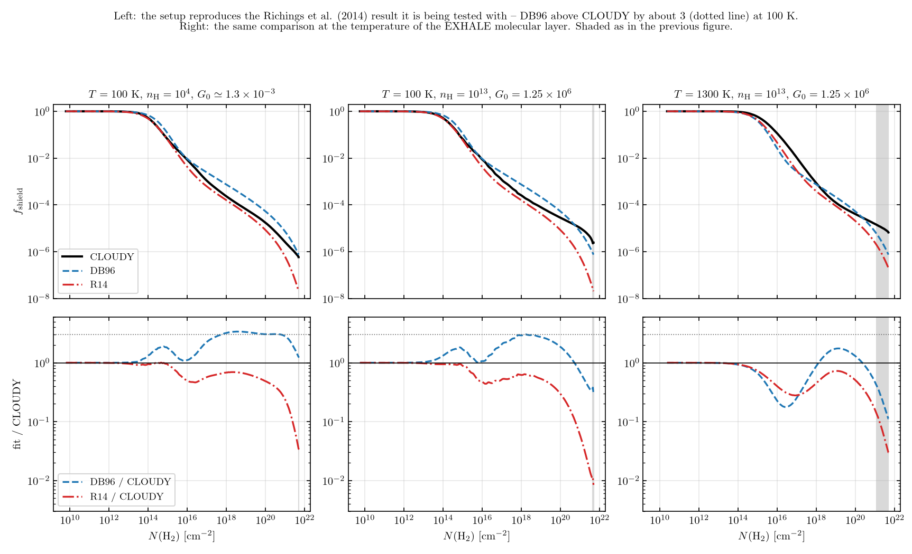
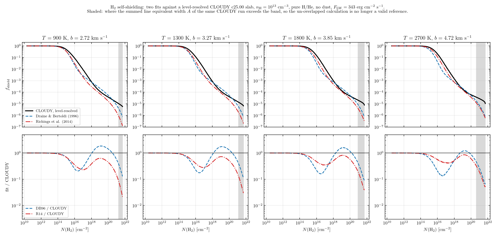
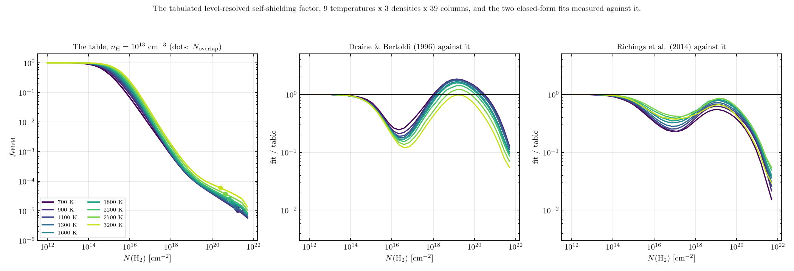

# H2 self-shielding measured against a level-resolved CLOUDY calculation

*2026-09-02. Follow-up to `Update_EXHALE_stage1.pdf` section 116.*

*__Outcome__: option 2 of section 1 was chosen. The grid was extended to
9 temperatures x 3 densities x 39 columns and tabulated in
`src/modules/lower_atmosphere/h2_self_shielding_table.f90`; the
photodissociation rate reads it and neither closed-form fit sets it any more.
Section 11 below records the extended grid. `Update_EXHALE_stage1.pdf` section 122 is
the changelog entry.*

> **SUPERSEDED 2026-09-03 as a statement about the code. The measurements
> below stand as readings of the CLOUDY runs they were made on.** Two things
> about the quantity tabulated here were later found to be wrong, and they hid
> each other.
>
> **(1) It is a rate for a sub-reservoir of H2, not for all of it.** The
> `Shield(H2)` column used throughout this note is
> `Solomon_dissoc_rate_g/G(TH85)`, the rate of CLOUDY's **H2g** species --
> `v = 0, J <= 8`, everything below `ENERGY_H2_STAR = 4100 cm^-1`
> (`h2.cpp:10`) -- while EXHALE carries one H2 species and applied it to all
> of it. H2s starts from levels 100 to 1000 times less populated, saturates
> far later, and dissociates 165 (1300 K) to 615 (900 K) times faster at
> `N_H2 = 1e19`. Weighting the two reservoirs by the densities the same runs
> report raises the tabulated factor by 1.2 to 11 times over
> `1e17 <= N_H2 <= 1e21`. **This defect made the rate too small at depth.**
>
> **(2) Line overlap is absent**, as section 7 already says. **That defect
> makes the rate too large**, and at our columns it is the larger of the two:
> the ratio of two calculations differing only in whether the lines absorb
> each other's beam is 0.62 at `N_H2 = 1e19`, 0.33 at `1e20`, 0.042 at `1e21`
> and 0.0016 at the `4.4e21` of our base, at 1300 K.
>
> **The two have opposite signs, they cross near `N_H2 = 2e20`, and below that
> they very nearly cancel** -- which is why neither was visible when this note
> was written, nor when `Update_EXHALE_stage1.pdf` section 132 turned the table into
> an absolute cross section.
>
> **Current state.** The table in
> `src/modules/lower_atmosphere/h2_self_shielding_table.f90` is rebuilt from a
> line-by-line calculation in which every Lyman and Werner line absorbs every
> other line's beam, checked against the Meudon PDR code (5-22 per cent over
> `1e19 <= N_H2 <= 1e21`), and it is a rate for all H2.
> `h2_shielding_overlap_column` no longer exists; `h2_shield_max_column()` --
> the top of the tabulated column axis, `5.0e21 cm^-2` -- replaces it. Only
> the fluorescent trapping `p_eff/p_single` still comes from the CLOUDY runs
> of this note, and the geometry it carries is still open.
> See `md/p38_line_overlap_shielding.md` and `Update_EXHALE_stage1.pdf` section 135.
>
> Sections 1-11 are left as measured. The **STALE** notes inside them mark the
> individual statements about the code, or about what the reference can be
> used for, that no longer hold.

---

## 1. The judgement

> **STALE (2026-09-03).** The verdict below ranks the two fits against a
> reference that is the H2g rate without line overlap. Both defects of the
> superseded block move that reference -- the first upward at depth, the
> second downward -- so which fit is closer, and by how much, is not settled
> by this section any more. What does survive is the shape argument of
> section 11: no two-term algebraic form puts the trough and the shoulder in
> the right places, which is why the calculation was tabulated instead of a
> fit being chosen. The tabulated values themselves have since been replaced
> (`Update_EXHALE_stage1.pdf` section 135).

**In the column range where our H2 actually lives and where the CLOUDY
calculation is still internally consistent, `1e18 <= N(H2) <= 5e20 cm^-2`,
Draine & Bertoldi (1996) is the *closer* of the two fits at every temperature
of our molecular layer, and Richings, Schaye & Oppenheimer (2014) is
systematically low.** Worst deviation from the level-resolved calculation over
that window, at `n_H = 1e13 cm^-3`:

| T [K] | Richings worst | at N(H2) | DB96 worst | at N(H2) |
|---|---|---|---|---|
| 900  | 0.232 (4.3x low) | 4.7e20 | 1.852 (1.9x high) | 1.5e19 |
| 1300 | 0.258 (3.9x low) | 5.0e20 | 1.751 (1.8x high) | 1.3e19 |
| 1800 | 0.294 (3.4x low) | 4.6e20 | 1.620 (1.6x high) | 1.6e19 |
| 2700 | 0.300 (3.3x low) | 4.9e20 | 0.427 (2.3x low)  | 4.9e20 |

**So the P18 change moved the rate away from the level-resolved answer, not
toward it, over the part of our layer that can be judged.** P18 adopted
Richings on the strength of the authors' finding that DB96 overestimates the
shielding factor by about 3 at `T = 100 K`. That finding is reproduced here
(section 3) and is not in doubt. What the measurement adds is that the sign of
the DB96 error *reverses* between 100 K and 900 K: at 100 K DB96 sits a factor
2.3-3.4 above the level-resolved result, by 900 K it has crossed to within a
factor 1.9 of it, and Richings -- which was built to remove that 100 K excess
-- keeps removing it after it has gone.

**Above `N(H2) ~ 1e21 cm^-2` neither fit can be judged by this calculation,
and the deepest cells of `mol_lyman_werner` (4.4e21) are in that range.** The
reason is measured, not assumed: the summed equivalent width of the H2 lines
implied by CLOUDY's own shielding curve passes the width of the 912-1110 A
band at `N(H2) = 1.7e21` (900 K), `1.3e21` (1300 K), `8.7e20` (1800 K) and
`4.4e20` (2700 K), and reaches 1.8 to 3.2 by 4.4e21 (section 7). A
band-removed fraction above 1 is impossible, so beyond those columns CLOUDY's
one-line-at-a-time shielding is over-counting the beam available to the
lines, and its `f_shield` is an upper bound rather than a reference. Both fits
fall steeply
enough there for their equivalent widths to saturate; CLOUDY's does not.

**Recommendation, for a decision rather than for action.** Three options, in
the order the measurement supports them:

1. **Return the dissociation rate to DB96** and record that the 100 K
   argument for Richings does not transfer to 900-2700 K. This is the option
   the numbers support directly, it removes the two-fit situation of section
   116.4 at a stroke, and it costs one golden refresh of `mol_lyman_werner`.
2. **Tabulate the CLOUDY grid and interpolate**, accepting DB96's own
   line-overlap suppression as a cap above the column where `A` reaches 1.
   Table size: `f_shield(T, N_H2)` on 4-6 temperatures (900-2700 K, log
   spaced) x 20-24 columns (1e14 to 5e21, 4 per decade), bilinear in
   `(log T, log N_H2)` -- about 500-900 doubles, the same shape as the
   `h3p_cooling` departure table. The `b` axis need not be carried: `b` is
   thermal, so it is a function of `T` already, and above 1e18 the term
   carrying `b` has collapsed.
3. **Keep Richings** and state that it is 3.3-4.3x low against the only
   level-resolved calculation we have run at our temperatures. This is the
   status quo and it is the option the measurement least supports.

Option 2 is the physically strongest and the most work; option 1 is what the
measurement says if only the two published fits are on the table. **No code
change has been made.**

---

## 2. What was run

CLOUDY c25.00, the build already present at
`~/CLOUDY/c25.00/source/cloudy.exe`, with `~/CLOUDY/c25.00/data`. Everything
below was run outside this repository; the decks, outputs and analysis scripts
are in the session scratch directory
`.../scratchpad/p24/runs/`. Nothing in `src/`, `build/`, `EXHALE.x` or `PATH`
was touched.

### 2.1 The deck

This is `t1300_n13.in` in full; the others differ only in the `constant
temperature`, `hden` and `intensity` lines.

```
title H2 self-shielding, T = 1300 K, n_H = 1e13 cm-3, primary grid
# --- incident radiation field -------------------------------------
# flat-F_lambda (f_nu ~ nu^-2) shape: the DB96 eq.(24) calibration that
# EXHALE's sigma_LW rests on.  Normalized to F = 343 erg cm^-2 s^-1
# over 912-1110 A = 0.82096-0.99920 Ryd (EXHALE "Stellar LW flux").
table power law -2.0, 0.009115, 20
intensity 2.535294, range 0.82096 to 0.99920 Ryd
# remove every H-ionizing photon
extinguish 24 0
# an ionization source is required, else no electrons, no H-, no H2
cosmic rays background
# --- gas ------------------------------------------------------------
hden 13
abundances "hhe.abn"
constant temperature 1300 K
database h2
# --- geometry / stopping ---------------------------------------------
stop H2 column density 21.7
stop temperature 2
stop zone 3000
iterate 1
# --- output ----------------------------------------------------------
print line faint 100
save h2 rates "t1300_n13.rat"
save overview "t1300_n13.ovr"
```

with the composition file `hhe.abn` alongside it:

```
#/* pure H + He, He/H = 0.0793 -- EXHALE hot-Uranus molecular gate */
HYDROGEN	1.0
HELIUM		0.0793
******************************
```

`abundances "<file>"` turns every element heavier than hydrogen off before
reading the file, so only the two elements named are present -- no metals, no
grains, and therefore no continuum absorber in the band other than the H
Lyman lines. **This matters: a first attempt with `abundances he = -1.1007`
alone left the default solar metals in place, and their photoionization
continuum absorbed the band by a factor 4.5e5 by `N(H) = 2.8e23 cm^-2`, which
swamps the line shielding entirely.** The band-integrated field of the runs
reported here falls by only 4% from face to `N(H2) = 5e21`.

`iterate 1` means two iterations; the second is used throughout. The two
differ by up to 15% at the deepest column and are within 5% below 1e20.

### 2.2 The radiation field, and the G0 conversion

`Stellar LW flux: 343.0` in `mol_lyman_werner` is the band-integrated energy
flux over 912-1110 A. 1 Ryd = 911.267 A, so that interval is
0.82096-0.99920 Ryd, and `intensity 2.535294, range 0.82096 to 0.99920 Ryd`
puts `log10(343)` into exactly it. `extinguish 24 0` then removes everything
above 1 Ryd, which is entirely outside the band, so the normalization is
unaffected.

The shape is `f_nu ~ nu^-2`, i.e. flat `F_lambda`, which is DB96's eq. (24)
spectrum and the one `sigma_lw = 3.452e-18 cm^2` in `lyman_werner.f90` was
derived from. `table power law -2.0, 0.009115, 20` gives that slope between
0.009115 and 20 Ryd.

**The Habing conversion, and why our band is not the Habing band.** The Habing
(1968) field is `1.6e-3 erg cm^-2 s^-1` integrated over 6-13.6 eV, i.e.
912-2066 A -- a 1154 A interval against our 198 A one. For a flat `F_lambda`
spectrum the energy in a wavelength interval is proportional to its width, so
`F(6-13.6 eV) = 343 x 1154/198 = 2.00e3 erg cm^-2 s^-1` and

    G_0 = 2.00e3 / 1.6e-3 = 1.25e6 Habing.

CLOUDY's own Tielens & Hollenbach measure of the same quantity, printed in
column `G(TH85)` of `save h2 rates`, is **1.25e6** at the illuminated face --
the arithmetic and the code agree.

A second, independent check of the normalization: CLOUDY's `G(DB96)` column is
the 912-1110 A photon flux divided by `1.232e7 x 1.71`, and its face value
8.31e5 corresponds to `1.751e13` band photons cm^-2 s^-1. `lyman_werner.f90`
uses `F/<hv>` with `<hv> = 2hc/(912+1110 A) = 12.2635 eV`, giving
`1.7457e13`. **These agree to 0.3%**, which is the exact statement that the
mean-photon-energy conversion in the module is right for a flat-`F_lambda`
band.

### 2.3 The Doppler parameter

CLOUDY's `GetDopplerWidth` returns `sqrt(2kT/m + v_turb^2)`, and `v_turb = 0`
with no `turbulence` command, which none of these decks gives. That is the
same definition as `h2_doppler_parameter`, `b = sqrt(2kT/m_H2)`, so the two
sides of the comparison use the same `b`: 2.72 km/s at 900 K to 4.72 km/s at
2700 K.

### 2.4 What is compared

`f_shield(N)` from CLOUDY is `Solomon_dissoc_rate_g(N) / G(TH85)(N)`, the
`Shield(H2)` column of `save h2 rates`, normalized to its own value in the
first zone of the same run. Dividing by the band-integrated field first
removes any residual continuum attenuation; normalizing inside the run removes
the absolute normalization of the field, so only the shielding survives. The
ground-state rate is used rather than the `BigH2` column, which is the sum of
the ground- and excited-state rate coefficients and is not a rate for any one
population.

> **STALE (2026-09-03).** This choice is defect (1) of the superseded block.
> `Solomon_dissoc_rate_g` is divided by the H2g density alone, so it is a rate
> for the `v = 0, J <= 8` reservoir, and the code applied it to all H2. The
> right quantity is neither this column nor `BigH2`: it is the
> density-weighted mean of the two reservoir rates, which needed four more
> columns of `save h2 rates` (`pump_s`, `diss_single_s`, `den_g`, `den_s`),
> a second CLOUDY patch, and the 27 decks re-run.

The fits are evaluated by `exhale_lw.py`, a line-by-line Python transcription
of `h2_self_shielding_richings`, `h2_self_shielding_draine_bertoldi`,
`h2_band_equivalent_width` and `h2_doppler_parameter` as the Fortran writes
them -- not of the papers. It reproduces the four spot values of section
116.2 exactly (DB96/Richings = 5.3967, 4.2954, 3.6089 at `N = 4.36e21` and
945/1140/1307 K, and 2.7921 at 1e20 and 1140 K).

A further internal check: CLOUDY carries its own coding of DB96 eq. (37) in
the `BD96` column of the same file. At 1000 K and `N(H2) = 5e21` its ratio to
the face value is 7.53e-7, against 7.5286e-7 from `exhale_lw.py`. The two
implementations of DB96, and the column and `b` they are fed, agree to three
digits.

---

## 3. The validation point, and the 100 K control

**One point first, as P24 asks.** At `T = 1000 K` and `N(H2) = 1e18 cm^-2`:
CLOUDY 8.1e-4, DB96 7.6e-4, Richings 3.3e-4. Same order of magnitude, so the
setup was not obviously broken and the grid was run.

**The control that matters more** is whether this pipeline reproduces the
comparison Richings et al. published, since that is the claim P18 acted on.
Their statement is that DB96 and the Wolcott-Green modification "both
overestimate S_self^H2 compared to CLOUDY by a factor of ~3 at H2 column
densities NH2 >~ 10^17 cm^-2 in gas with a temperature T = 100 K". Run at
100 K in interstellar-like conditions (`n_H = 1e4 cm^-3`, `G_0 = 1.25e-3`):

**DB96/CLOUDY = 2.27 to 3.38 over `1e17 <= N(H2) <= 5e20`** -- their factor of
about 3, from our own deck. Richings itself lands at 0.35-0.69 of CLOUDY over
the same range, and at 0.24-1.00 over the `N(H2) < 1e21` range for which the
paper quotes agreement to within 30 per cent.

That last number is worth stating plainly: **against our CLOUDY c25.00 the
Richings fit is up to 76% low at 100 K below 1e21, where the paper quotes
agreement to within 30%.** Their calculation was made with a 2014-era
CLOUDY at conditions we can only approximate, so this is not an audit of their
published accuracy.
It does mean the ratios in this note should be read as ratios within one
consistent setup, and that a systematic offset of order 1.5-2 between our
reference and theirs cannot be excluded. It is not large enough to change any
conclusion drawn here, all of which rest on factors of 3 and more.



---

## 4. The grid

`T = 900, 1300, 1800, 2700 K` at `n_H = 1e13 cm^-3`, plus `n_H = 1e12` and
`1e14` at 1300 K, plus five diagnostics and four control points at 100 and
300 K; 15 runs in all, each reaching
`N(H2) = 5.0e21 cm^-2` in 270-380 zones and taking 1.5-3 minutes.



The shape of the disagreement is the same at every temperature and is a
two-lobed thing, not an offset:

* **`N(H2) < 1e17`.** Both fits shield too much; CLOUDY keeps `f_shield`
  higher because a warm rotational ladder spreads the pumping over more lines,
  each of which stays optically thin longer. Richings is the better of the two
  here (0.24-0.56 of CLOUDY against DB96's 0.13-0.30), which is the one place
  its temperature dependence does what it was built to do. This is also the
  regime DB96's own body text warns about -- they state a dependence on the
  rovibrational distribution for `1e14 < N2 < 1e18`.
* **`1e18 < N(H2) < 5e20`.** The order reverses. DB96 tracks CLOUDY to within
  a factor 1.9 at 900 K and 1.6 at 1800 K; Richings falls to 0.23-0.30.
* **`N(H2) > 1e21`.** Both fits drop away from CLOUDY, Richings faster, but
  CLOUDY is not a reference here (section 7).

---

## 5. Tables

### Table 1 -- f_shield: CLOUDY against the two coded fits, n_H = 1e13 cm^-3

**T = 900 K**, b = 2.725 km/s. The CLOUDY column is a valid reference only up
to N(H2) = 1.70e+21 cm^-2 (marked *), where its own summed line equivalent
width reaches the width of the band.

| N(H2) [cm^-2] | CLOUDY | Richings | DB96 | Richings/CLOUDY | DB96/CLOUDY |
|---|---|---|---|---|---|
| 1e+16 | 8.644e-02 | 3.025e-02 | 2.148e-02 | 0.350 | 0.249 |
| 3e+16 | 3.017e-02 | 7.927e-03 | 6.273e-03 | 0.263 | 0.208 |
| 1e+17 | 8.660e-03 | 2.056e-03 | 2.613e-03 | 0.237 | 0.302 |
| 3e+17 | 2.784e-03 | 7.430e-04 | 1.418e-03 | 0.267 | 0.509 |
| 1e+18 | 7.952e-04 | 3.061e-04 | 7.550e-04 | 0.385 | 0.949 |
| 3e+18 | 2.865e-04 | 1.538e-04 | 4.232e-04 | 0.537 | 1.477 |
| 1e+19 | 1.199e-04 | 7.519e-05 | 2.195e-04 | 0.627 | 1.830 |
| 3e+19 | 6.598e-05 | 3.823e-05 | 1.160e-04 | 0.579 | 1.758 |
| 1e+20 | 3.776e-05 | 1.672e-05 | 5.351e-05 | 0.443 | 1.417 |
| 2e+20 | 2.771e-05 | 9.663e-06 | 3.233e-05 | 0.349 | 1.167 |
| 5e+20 | 1.831e-05 | 4.104e-06 | 1.496e-05 | 0.224 | 0.817 |
| 1e+21 | 1.335e-05 | 1.854e-06 | 7.439e-06 | 0.139 | 0.557 |
| 2e+21 * | 9.672e-06 | 6.964e-07 | 3.197e-06 | 0.072 | 0.331 |
| 3e+21 * | 7.978e-06 | 3.500e-07 | 1.781e-06 | 0.044 | 0.223 |
| 4e+21 * | 6.783e-06 | 2.013e-07 | 1.118e-06 | 0.030 | 0.165 |
| 5e+21 * | 5.831e-06 | 1.255e-07 | 7.529e-07 | 0.022 | 0.129 |

**T = 1300 K**, b = 3.275 km/s. The CLOUDY column is a valid reference only up
to N(H2) = 1.26e+21 cm^-2 (marked *), where its own summed line equivalent
width reaches the width of the band.

| N(H2) [cm^-2] | CLOUDY | Richings | DB96 | Richings/CLOUDY | DB96/CLOUDY |
|---|---|---|---|---|---|
| 1e+16 | 1.169e-01 | 4.698e-02 | 2.671e-02 | 0.402 | 0.228 |
| 3e+16 | 3.987e-02 | 1.229e-02 | 7.037e-03 | 0.308 | 0.176 |
| 1e+17 | 1.077e-02 | 3.017e-03 | 2.690e-03 | 0.280 | 0.250 |
| 3e+17 | 3.135e-03 | 1.011e-03 | 1.427e-03 | 0.323 | 0.455 |
| 1e+18 | 8.729e-04 | 3.895e-04 | 7.558e-04 | 0.446 | 0.866 |
| 3e+18 | 3.089e-04 | 1.897e-04 | 4.233e-04 | 0.614 | 1.370 |
| 1e+19 | 1.267e-04 | 9.180e-05 | 2.195e-04 | 0.724 | 1.732 |
| 3e+19 | 6.982e-05 | 4.686e-05 | 1.160e-04 | 0.671 | 1.662 |
| 1e+20 | 4.099e-05 | 2.084e-05 | 5.351e-05 | 0.508 | 1.305 |
| 2e+20 | 3.074e-05 | 1.224e-05 | 3.233e-05 | 0.398 | 1.052 |
| 5e+20 | 2.091e-05 | 5.379e-06 | 1.496e-05 | 0.257 | 0.715 |
| 1e+21 | 1.553e-05 | 2.526e-06 | 7.439e-06 | 0.163 | 0.479 |
| 2e+21 * | 1.152e-05 | 1.002e-06 | 3.197e-06 | 0.087 | 0.277 |
| 3e+21 * | 9.503e-06 | 5.250e-07 | 1.781e-06 | 0.055 | 0.187 |
| 4e+21 * | 8.028e-06 | 3.129e-07 | 1.118e-06 | 0.039 | 0.139 |
| 5e+21 * | 6.704e-06 | 2.013e-07 | 7.529e-07 | 0.030 | 0.112 |

**T = 1800 K**, b = 3.854 km/s. The CLOUDY column is a valid reference only up
to N(H2) = 8.70e+20 cm^-2 (marked *), where its own summed line equivalent
width reaches the width of the band.

| N(H2) [cm^-2] | CLOUDY | Richings | DB96 | Richings/CLOUDY | DB96/CLOUDY |
|---|---|---|---|---|---|
| 1e+16 | 1.482e-01 | 7.007e-02 | 3.279e-02 | 0.473 | 0.221 |
| 3e+16 | 4.954e-02 | 1.865e-02 | 7.966e-03 | 0.376 | 0.161 |
| 1e+17 | 1.246e-02 | 4.430e-03 | 2.784e-03 | 0.356 | 0.224 |
| 3e+17 | 3.655e-03 | 1.398e-03 | 1.438e-03 | 0.383 | 0.393 |
| 1e+18 | 1.016e-03 | 5.059e-04 | 7.568e-04 | 0.498 | 0.745 |
| 3e+18 | 3.551e-04 | 2.385e-04 | 4.234e-04 | 0.672 | 1.192 |
| 1e+19 | 1.388e-04 | 1.140e-04 | 2.195e-04 | 0.821 | 1.581 |
| 3e+19 | 7.609e-05 | 5.830e-05 | 1.160e-04 | 0.766 | 1.525 |
| 1e+20 | 4.622e-05 | 2.629e-05 | 5.351e-05 | 0.569 | 1.158 |
| 2e+20 | 3.558e-05 | 1.568e-05 | 3.233e-05 | 0.441 | 0.908 |
| 5e+20 | 2.537e-05 | 7.100e-06 | 1.496e-05 | 0.280 | 0.590 |
| 1e+21 * | 1.958e-05 | 3.451e-06 | 7.439e-06 | 0.176 | 0.380 |
| 2e+21 * | 1.494e-05 | 1.437e-06 | 3.197e-06 | 0.096 | 0.214 |
| 3e+21 * | 1.243e-05 | 7.817e-07 | 1.781e-06 | 0.063 | 0.143 |
| 4e+21 * | 1.040e-05 | 4.808e-07 | 1.118e-06 | 0.046 | 0.108 |
| 5e+21 * | 7.897e-06 | 3.181e-07 | 7.529e-07 | 0.040 | 0.095 |

**T = 2700 K**, b = 4.720 km/s. The CLOUDY column is a valid reference only up
to N(H2) = 4.36e+20 cm^-2 (marked *), where its own summed line equivalent
width reaches the width of the band.

| N(H2) [cm^-2] | CLOUDY | Richings | DB96 | Richings/CLOUDY | DB96/CLOUDY |
|---|---|---|---|---|---|
| 1e+16 | 2.068e-01 | 1.150e-01 | 4.278e-02 | 0.556 | 0.207 |
| 3e+16 | 6.769e-02 | 3.214e-02 | 9.583e-03 | 0.475 | 0.142 |
| 1e+17 | 1.801e-02 | 7.500e-03 | 2.952e-03 | 0.416 | 0.164 |
| 3e+17 | 5.219e-03 | 2.227e-03 | 1.457e-03 | 0.427 | 0.279 |
| 1e+18 | 1.443e-03 | 7.460e-04 | 7.586e-04 | 0.517 | 0.526 |
| 3e+18 | 4.960e-04 | 3.358e-04 | 4.236e-04 | 0.677 | 0.854 |
| 1e+19 | 1.883e-04 | 1.573e-04 | 2.195e-04 | 0.835 | 1.166 |
| 3e+19 | 9.861e-05 | 8.054e-05 | 1.160e-04 | 0.817 | 1.177 |
| 1e+20 | 6.089e-05 | 3.693e-05 | 5.351e-05 | 0.606 | 0.879 |
| 2e+20 | 4.822e-05 | 2.242e-05 | 3.233e-05 | 0.465 | 0.670 |
| 5e+20 * | 3.565e-05 | 1.053e-05 | 1.496e-05 | 0.295 | 0.420 |
| 1e+21 * | 2.807e-05 | 5.337e-06 | 7.439e-06 | 0.190 | 0.265 |
| 2e+21 * | 2.159e-05 | 2.359e-06 | 3.197e-06 | 0.109 | 0.148 |
| 3e+21 * | 1.795e-05 | 1.343e-06 | 1.781e-06 | 0.075 | 0.099 |
| 4e+21 * | 1.496e-05 | 8.586e-07 | 1.118e-06 | 0.057 | 0.075 |
| 5e+21 * | 1.080e-05 | 5.878e-07 | 7.529e-07 | 0.054 | 0.070 |

### Table 2 -- density and radiation-field axes at T = 1300 K

| N(H2) [cm^-2] | n=1e12 | n=1e13 | n=1e14 | max/min | F_LW/1e4 over n=1e13 | H Lyman pumping off over n=1e13 |
|---|---|---|---|---|---|---|
| 1e+17 | 1.040e-02 | 1.077e-02 | 1.027e-02 | 1.049 | 0.956 | 1.044 |
| 1e+18 | 8.837e-04 | 8.729e-04 | 8.543e-04 | 1.034 | 0.995 | 1.057 |
| 1e+19 | 1.337e-04 | 1.267e-04 | 1.254e-04 | 1.066 | 1.018 | 1.092 |
| 1e+20 | 4.562e-05 | 4.099e-05 | 3.988e-05 | 1.144 | 0.988 | 1.094 |
| 1e+21 | 2.036e-05 | 1.553e-05 | 1.456e-05 | 1.398 | 0.940 | 1.107 |
| 4e+21 | 1.024e-05 | 8.028e-06 | 7.427e-06 | 1.379 | 0.909 | 1.018 |

### Table 3 -- the 100 K control, against the comparison Richings et al. published

| N(H2) [cm^-2] | CLOUDY | Richings | DB96 | Richings/CLOUDY | DB96/CLOUDY |
|---|---|---|---|---|---|
| 1e+16 | 8.522e-03 | 4.252e-03 | 9.429e-03 | 0.499 | 1.106 |
| 3e+16 | 3.241e-03 | 1.517e-03 | 4.666e-03 | 0.468 | 1.440 |
| 1e+17 | 1.094e-03 | 6.214e-04 | 2.459e-03 | 0.568 | 2.248 |
| 3e+17 | 5.039e-04 | 3.160e-04 | 1.400e-03 | 0.627 | 2.779 |
| 1e+18 | 2.353e-04 | 1.601e-04 | 7.534e-04 | 0.681 | 3.203 |
| 3e+18 | 1.252e-04 | 8.660e-05 | 4.230e-04 | 0.691 | 3.378 |
| 1e+19 | 6.594e-05 | 4.281e-05 | 2.195e-04 | 0.649 | 3.328 |
| 3e+19 | 3.650e-05 | 2.112e-05 | 1.160e-04 | 0.579 | 3.179 |
| 1e+20 | 1.751e-05 | 8.536e-06 | 5.351e-05 | 0.487 | 3.056 |
| 2e+20 | 1.059e-05 | 4.572e-06 | 3.233e-05 | 0.432 | 3.054 |
| 5e+20 | 4.909e-06 | 1.667e-06 | 1.496e-05 | 0.340 | 3.048 |
| 1e+21 | 2.627e-06 | 6.338e-07 | 7.439e-06 | 0.241 | 2.832 |
| 2e+21 | 1.427e-06 | 1.864e-07 | 3.197e-06 | 0.131 | 2.241 |
| 3e+21 | 1.005e-06 | 7.761e-08 | 1.781e-06 | 0.077 | 1.773 |
| 4e+21 | 7.627e-07 | 3.810e-08 | 1.118e-06 | 0.050 | 1.466 |
| 5e+21 | 6.010e-07 | 2.067e-08 | 7.529e-07 | 0.034 | 1.253 |

(T = 100 K, n_H = 1e4 cm^-3, F_LW = 3.43e-7 erg cm^-2 s^-1, i.e. G_0 =
1.25e-3; A reaches the band width at N(H2) = 5.01e+21 cm^-2.)

### Table 4 -- unattenuated rate and band-removal constants

| T [K] | n_H [cm^-3] | CLOUDY sigma_diss [cm^2] | sigma_diss / sigma_lw (code) |
|---|---|---|---|
| 100 | 1e+13 | 4.7339e-18 | 1.371 |
| 300 | 1e+13 | 4.5554e-18 | 1.320 |
| 900 | 1e+13 | 4.2555e-18 | 1.233 |
| 1000 | 1e+13 | 4.3412e-18 | 1.258 |
| 1300 | 1e+13 | 4.6196e-18 | 1.338 |
| 1800 | 1e+13 | 4.9838e-18 | 1.444 |
| 2700 | 1e+13 | 5.5121e-18 | 1.597 |
| 1300 | 1e+12 | 5.0623e-18 | 1.466 |
| 1300 | 1e+14 | 4.4840e-18 | 1.299 |

---

## 6. The three axes the fits do not carry

**Density.** Richings takes no density argument, and over `n_H = 1e12, 1e13,
1e14 cm^-3` at 1300 K the level-resolved `f_shield` moves by 3-7% below
`N(H2) = 1e19` and by at most 40% at 1e21 (Table 2), the higher density
shielding slightly more. Our layer spans `n_H` up to `9.3e13 cm^-3`, so the
density axis is a non-issue at our conditions and the absence of a density
argument in either fit is not what is wrong with them. (A far wider probe,
`n_H = 1e6` at 1000 K with the field scaled down by the same factor, sits
within 6% of the `n_H = 1e13` curve everywhere, so the whole range from an
interstellar density to a planetary base is one curve at our temperatures.)

**Radiation-field strength -- the Elwert axis.** Dropping `F_LW` by four
decades, from 343 to 3.43e-2 erg cm^-2 s^-1 (`G_0` from 1.25e6 to 125),
changes `f_shield` by at most 9% anywhere on the grid, and by under 5% below
`N(H2) = 1e20` (Table 2). **This settles by measurement what section 116.3
settled by arithmetic: there is no radiation-field correction to be made
here.** The reason the two arguments agree is that they are the same argument
-- the Elwert exponent modifies DB96's first term, and by `1e18` that term
carries none of the function.

**H Lyman-line absorption inside the band.** Ly-beta 1025.7 A, Ly-gamma
972.5 A and the rest of the series lie in the LW band, and at our densities
the H column at a given `N(H2)` is far larger than in the PDRs DB96 fitted --
`lyman_werner.f90` section 4 calls this the least controlled of the three
absorbers it neglects. Running with `Database H-like Lyman pumping off`
changes the level-resolved `f_shield` by 2-11% (Table 2), always upward, i.e.
the H Lyman lines do remove a little of the band, and it is a few per cent.
**The module's decision to neglect them is safe at our conditions**, and this
is the first direct check of that.

---

## 7. Where the calculation stops being a reference

CLOUDY shields each line separately. `RT_continuum_shield_fcn` applies the
Federman, Glassgold & Kwan (1979) function to each transition using that
transition's own optical depth and damping constant, and there is no term
coupling one line to another; the options carried alongside it (`pesc`,
`ferland`, `rodgers`, `integral`) each act on one line at a time as well.
**Overlap between distinct H2 lines is therefore absent from the
calculation**, and overlap is
exactly what DB96 say dominates the deep regime: their section 5.2 describes
"the rapid falloff due to line overlap for N2 > 1e20 cm^-2", and reports that
at `N2 = 3e21` "line overlap effects suppress the pumping rates by a factor
~10".

The size of the resulting error can be read off the runs themselves, without
appeal to DB96. Build the summed equivalent width of the pumping lines from
CLOUDY's own shielding curve, using DB96's eq. (38) construction that
`lyman_werner.f90` already carries,

    A(N) = sigma_lw_pump * integral_0^N f_shield(N') dN' ,

with `sigma_lw_pump = 2.557e-17 cm^2` from the module. `A` is a fraction of
the band and cannot exceed 1. It does:

| T [K] | N(H2) at which A = 1 | A at 4.4e21 |
|---|---|---|
| 100  | 4.46e21 | 1.00 |
| 900  | 1.70e21 | 1.56 |
| 1300 | 1.26e21 | 1.81 |
| 1800 | 8.70e20 | 2.24 |
| 2700 | 4.36e20 | 3.15 |

So the run stays self-consistent almost to the end of the grid at 100 K --
which is why the Richings fit could be built against a calculation like this
one at 100 K -- and breaks down earlier the hotter the gas, because a warm
ladder puts more lines into the same band. **At 4.4e21 and 1300 K the
un-overlapped line sum claims 1.8 times the whole band.** The logarithmic
slope says the same thing: over `1e20` to `5e21` at 1300 K the level-resolved
`f_shield` falls as `N^-0.46`, the pure damping-wing law with nothing
suppressing it, while DB96 falls as `N^-1.09` and Richings faster still. A
`f_shield` falling more slowly than `N^-1` cannot have a convergent
equivalent width, and both fits do converge.

**The consequence for the judgement.** Above the columns in the table the
level-resolved rate is an upper bound, so "both fits are low there" is not a
finding. Below them the calculation is a reference, and that is where section
1 draws its conclusion from. It is also worth noting which way the missing
physics pushes: correcting CLOUDY for overlap would lower it, moving it toward
DB96 and further from Richings, so the missing ingredient does not threaten
the direction of the verdict -- only its size, and only above 1e21.

> **STALE (2026-09-03): "only above 1e21" is too generous, and the equivalent
> width was the wrong boundary.** Measured with two line-by-line calculations
> differing only in whether the lines absorb each other's beam, overlap
> already suppresses the rate by 1.6x at `N_H2 = 1e19` and 3.0x at `1e20` at
> 1300 K, rising to 24x at `1e21` and 630x at `4.4e21`. At the column the
> equivalent-width construction of this section returns, the table stood 7 to
> 10 times above the overlapping-line answer. The direction argued here is
> right; the size and the location of the boundary are not.

---

## 8. Two constants of the module, measured in passing

> **Corrected and superseded by `md/p39_lw_cross_section_sources.md` and
> `Update_EXHALE_stage1` section 132 (2026-09-02).** Two statements below are wrong.
> (i) The 0.177 is the EFFECTIVE branching, which carries the trapping of the
> fluorescent decay photons; the single-pump branching the module's 0.135 has
> to be compared against is **0.1466**, measured, and the two data sets agree
> to 0.8 per cent. (ii) The depth profile quoted is the effective one and its
> endpoints understate it -- it peaks near 0.29 at `N(H2) ~ 1e17`, and the
> single-pump profile is a different curve (0.147 at the face, 0.226 at 1e17,
> 0.151 at 5e21). The module now takes the cross section and both branchings
> from the table rather than from these constants.

**The band-removal cross section is confirmed.** From the `save h2 solomon`
output of the 1300 K run, the pump-to-dissociation ratio at the illuminated
face is 5.65, so the level-resolved dissociation probability per pump is
`<p_diss> = 0.177`, against the 0.135 the module takes from DB96's Table 2
(the `T_r = 100 K` row). Combining it with the face dissociation rate gives

    sigma_pump(CLOUDY, 1300 K) = 2.610e-17 cm^2
    sigma_lw_pump (module)     = 2.557e-17 cm^2      ratio 1.021

**These agree to 2%.** The two departures cancel: CLOUDY's dissociation cross
section is 34% above the module's, and its `<p_diss>` is 31% above 0.135, and
the band-removal cross section is their ratio. So the normalization that the
band share `A` rests on -- the one section 116.4 kept `A` on DB96 for -- is
independently confirmed at our temperature, even though neither constant it is
built from is. `<p_diss>` is not constant with depth either: it rises from
0.177 at the face to 0.217 at `N(H2) = 5e21`, which the module treats as fixed.

**The unattenuated rate constant is 23-60% low.** `sigma_lw = 3.452e-18 cm^2`
is DB96's flat-`F_lambda`, `T_r = 100 K` calibration. The same quantity read
off the illuminated face of these runs, `zeta_diss(0)/F_photon(0)`, is

| T [K] | 100 | 300 | 900 | 1000 | 1300 | 1800 | 2700 |
|---|---|---|---|---|---|---|---|
| CLOUDY/module | 1.37 | 1.32 | 1.23 | 1.26 | 1.34 | 1.44 | 1.60 |

so the module's unshielded rate is low by 23% at 900 K and by 60% at 2700 K.
Most of that is not temperature -- the 100 K value is already 37% high -- so
it is largely a difference between CLOUDY's H2 line data and DB96's Table 1-2
normalization, and it sits inside, or just outside, the +-25% spectral-shape
range the module already states for `sigma_lw`. It is recorded rather than
acted on. Note that it does not enter the comparison of sections 3-5 at all,
which is a ratio taken inside each run.

**Both constants of this section are now settled** (`md/p39_lw_cross_section_sources.md`, `Update_EXHALE_stage1` section 132).
Both sources were read. The two line data sets are the same measurements for
this band average -- the CLOUDY files reproduce DB96's Table 1-2 to under
1 per cent -- and the gap recorded above is line trapping, which the converged
CLOUDY pass carries and DB96's unshielded tables do not.

---

## 9. Limitations

* **Line overlap is absent from the reference** (section 7). This is the
  binding one, and it is why the verdict is stated for `N(H2) <= 5e20` only.
  **STALE (2026-09-03), and one limitation was missed.** The reference is also
  a rate for CLOUDY's H2g reservoir rather than for all H2, defect (1) of the
  superseded block. Restricting the verdict to `N(H2) <= 5e20` contains
  neither defect: at 1300 K the reservoir weighting is already 4.2x at
  `N_H2 = 1e19` and the overlap suppression 1.6x there.
* **The reference is not the reference Richings et al. used.** CLOUDY c25.00
  against a 2014-era build, our conditions against theirs; the 100 K control
  suggests a systematic offset of order 1.5-2 between the two (section 3).
* **The H2 level populations are collisional here.** At `n_H >= 1e12` a
  typical H-H2 rotational rate coefficient of 1e-11 cm^3 s^-1 puts the
  collisional rates four to five orders above the pumping rate of 4e-4 s^-1 --
  an estimate, not something these runs measure -- so the absorbing H2 should
  be in LTE at the imposed temperature, and the flatness of the density and
  radiation-field axes is consistent with that. That is the right
  physics for our base, and it is also why the density and radiation-field
  axes come out flat; it is *not* the situation DB96 built their fit in, where
  the distribution is set by UV pumping and by formation on grains. What the
  runs measure is therefore the LTE-population branch of the problem
  specifically.
* **The chemistry is CLOUDY's, not ours.** The H2 abundance through the slab
  is whatever CLOUDY's network gives for pure H/He with a cosmic-ray
  background and no grains. That sets how quickly the column accumulates and
  nothing else: `f_shield` is read against `N(H2)`, so a different H2 fraction
  would sample the same curve at different depths.
* **Constant temperature.** Every run fixes `T`, so the level populations do
  not respond to the depth-dependent heating our own layer has. The fits are
  functions of a single `T` as well, so this matches how they are used.
* **What was not checked**: the ortho/para ratio through the slab (CLOUDY sets
  it from its own chemistry, and both fits are blind to it); the sensitivity
  to CLOUDY's `set continuum shielding` choice, left at the default Federman
  form; and any dependence on the spectrum *within* the band, since all runs
  use the one flat-`F_lambda` shape the module is calibrated to.

---

## 10. Reproducing this

```
export CLOUDY_DATA_PATH=".:$HOME/CLOUDY/c25.00/data"     # cwd first, for hhe.abn
$HOME/CLOUDY/c25.00/source/cloudy.exe -r t1300_n13       # ~2 min, 350 zones
```

The 14 decks, their outputs, `exhale_lw.py` (the transcription of the Fortran),
`analyse.py`, `final.py` and the two figure scripts are in the session scratch
directory `.../scratchpad/p24/`. They are not in the repository: only this note
and the two PNGs under `docs/lower_atmosphere_figs/` are.

---

## 11. The extended grid, and what was built from it (2026-09-02)

The four-temperature grid of sections 4-5 was too coarse to interpolate, so it
was extended to **T = 700, 900, 1100, 1300, 1600, 1800, 2200, 2700, 3200 K**
at **n_H = 1e12, 1e13, 1e14 cm^-3** -- 27 runs on the same deck, every one
carried to `N(H2) = 5.01e21 cm^-2` and stopping on the H2 column in its second
iteration.



The left panel is what settled the choice. The level-resolved curve has a
**trough near `1e16-1e17` and a shoulder near `1e19`**, and the middle and
right panels show that neither fit reproduces either: DB96 dips to 0.13-0.27
of the calculation in the trough and rises to 1.1-1.8 on the shoulder,
Richings stays low throughout. A two-term algebraic form of this kind has no
freedom to put a trough and a shoulder in the right places, so **rescaling or
choosing between the fits could not have worked**, and the calculation itself
was tabulated instead.

### 11.1 What the table is

`log10 f_shield` on 39 columns x 9 temperatures x 3 densities = **1053
doubles**, trilinear in `(log10 T, log10 n_H, log10 N_H2)`, every axis clamped
rather than extrapolated. Generated by
`src/utils/h2_shielding_table_from_cloudy.py` from the 27 decks in
`src/utils/h2_shielding_cloudy_decks/`, so it can be rebuilt.

> **STALE (2026-09-03).** That generator still exists and still reads those
> decks, but it now weights the two H2 reservoirs and it no longer produces
> the installed table: `src/utils/h2_shielding_table_line_by_line.py` does.
> The shape (39 columns x 9 temperatures x 3 densities), the axes and the
> accessors are unchanged; the physics behind every number is not.

**The column axis starts at 1e12 cm^-2, not at the 1e16 that was planned.**
`f_shield(1e16)` is 0.067 at 700 K and 0.24 at 3200 K -- the transition is
already well under way there -- so a table starting at 1e16 would have needed
an invented rule beneath it. At 1e12 the measured factor is 1.000 in every run
(0.9989 in the worst), which is the optically thin limit, so the bottom clamp
asserts only what the runs show. The cost is 432 extra doubles.

### 11.2 Where it stops being a value

> **STALE (2026-09-03): `h2_shielding_overlap_column` no longer exists**, nor
> does the `h2_shield_log_col_overlap` plane it interpolated. The boundary
> this subsection defines was also about a decade optimistic -- at the column
> the function returned, the table already stood 7 to 10 times above the
> overlapping-line answer. With overlap inside the table there is no column
> above which the value stops meaning anything, and `h2_shield_max_column()`
> returns the top of the tabulated column axis, `5.0e21 cm^-2`, above which
> the edge value is used; the two run-time warnings that quoted the old
> boundary now report that extrapolation instead. Table 6 below is kept as the
> record of what the boundary was.

`h2_shielding_overlap_column(T, n_H)` returns the column at which `A(N)`,
built from the same CLOUDY curve by the integral of section 7, reaches the
width of the band. Table 6 gives it: **1.4-1.8e21 cm^-2 at 700 K falling
monotonically to 2.5e20 at 3200 K**, the hotter gas breaking down earlier
because more lines share the same band. Above it the tabulated factor is an
upper bound on the shielding and a lower bound on the rate, no correction is
applied, and the run reports the crossing once. Our molecular base sits at
`N(H2) = 4.4e21`, i.e. 2.6-3.3 times past the boundary, so the deepest cells
carry that bound. Closing it needs a code that treats line overlap.

### Table 5 -- the extended grid: f_shield(T, N_H2) at n_H = 1e13 cm^-3

| N(H2) [cm^-2] | 700 K | 900 K | 1100 K | 1300 K | 1600 K | 1800 K | 2200 K | 2700 K | 3200 K |
|---|---|---|---|---|---|---|---|---|---|
| 1.0e+16 | 6.705e-02 | 8.619e-02 | 1.024e-01 | 1.162e-01 | 1.355e-01 | 1.479e-01 | 1.715e-01 | 2.033e-01 | 2.394e-01 |
| 1.0e+17 | 7.193e-03 | 8.901e-03 | 9.995e-03 | 1.075e-02 | 1.182e-02 | 1.269e-02 | 1.467e-02 | 1.783e-02 | 2.212e-02 |
| 1.0e+18 | 7.677e-04 | 7.990e-04 | 8.330e-04 | 8.762e-04 | 9.568e-04 | 1.024e-03 | 1.180e-03 | 1.489e-03 | 1.800e-03 |
| 1.0e+19 | 1.236e-04 | 1.211e-04 | 1.233e-04 | 1.277e-04 | 1.355e-04 | 1.423e-04 | 1.617e-04 | 1.893e-04 | 2.334e-04 |
| 1.0e+20 | 3.898e-05 | 3.777e-05 | 3.933e-05 | 4.106e-05 | 4.414e-05 | 4.642e-05 | 5.144e-05 | 6.095e-05 | 7.838e-05 |
| 5.0e+20 | 2.028e-05 | 1.831e-05 | 1.954e-05 | 2.080e-05 | 2.374e-05 | 2.529e-05 | 2.863e-05 | 3.565e-05* | 4.821e-05* |
| 1.0e+21 | 1.544e-05 | 1.334e-05 | 1.432e-05 | 1.546e-05 | 1.824e-05* | 1.960e-05* | 2.208e-05* | 2.795e-05* | 3.818e-05* |
| 4.4e+21 | 6.751e-06* | 6.293e-06* | 6.778e-06* | 7.281e-06* | 8.260e-06* | 8.783e-06* | 9.721e-06* | 1.217e-05* | 1.573e-05* |

(* the tabulated factor is an upper bound there: the summed line
equivalent width has already claimed the whole band.)

> **STALE (2026-09-03).** These are H2g `f_shield` values without line
> overlap, and they are no longer what the code interpolates: both defects of
> the superseded block apply to every entry. They remain the correct reading
> of the CLOUDY runs of this note. The asterisks mark the old overlap
> boundary, which no longer exists in the code.

### Table 6 -- N_overlap(T, n_H), the column above which the table is an upper bound

*(As it was computed. `h2_shielding_overlap_column` no longer exists and the
table now carries line overlap -- see the note at the head of section 11.2.)*

| T [K] | n_H = 1e12 | n_H = 1e13 | n_H = 1e14 |
|---|---|---|---|
| 700 | 1.391e+21 | 1.520e+21 | 1.666e+21 |
| 900 | 1.225e+21 | 1.697e+21 | 1.775e+21 |
| 1100 | 1.073e+21 | 1.463e+21 | 1.555e+21 |
| 1300 | 9.561e+20 | 1.263e+21 | 1.375e+21 |
| 1600 | 8.364e+20 | 9.932e+20 | 1.147e+21 |
| 1800 | 7.603e+20 | 8.696e+20 | 1.001e+21 |
| 2200 | 6.097e+20 | 6.672e+20 | 7.040e+20 |
| 2700 | 4.222e+20 | 4.359e+20 | 4.356e+20 |
| 3200 | 2.453e+20 | 2.483e+20 | 2.514e+20 |

### Table 7 -- the two fits against the extended grid, n_H = 1e13, over 1e18 <= N <= N_overlap

| T [K] | Richings/CLOUDY worst | DB96/CLOUDY worst |
|---|---|---|
| 700 | 0.114 | 0.535 |
| 900 | 0.094 | 0.410 |
| 1100 | 0.171 | 1.810 |
| 1300 | 0.183 | 0.532 |
| 1600 | 0.189 | 0.454 |
| 1800 | 0.197 | 0.422 |
| 2200 | 0.308 | 0.537 |
| 2700 | 0.410 | 0.584 |
| 3200 | 0.361 | 0.482 |

### 11.3 Verification of the table itself

*This verifies the table as section 122 installed it, i.e. the superseded one.
The table now in the tree was verified again in `Update_EXHALE_stage1.pdf` section
135.*

* A probe program linked against `h2_self_shielding_table.o` reproduces the
  Python-side value at **all 1053 grid points to 1.2e-9 relative**, and
  `N_overlap` at all 27 to the same, so the Fortran interpolation returns the
  CLOUDY numbers themselves at the nodes.
* Off the nodes, at the mid-points of the 1300 K column axis, the table
  reproduces the run it was built from to **0.6-1.9%**, which is what the
  spacing of about four points per decade buys.
* Clamping was checked at every edge: below the bottom of the column axis the
  table returns 1.000; `T = 300 K` returns the 700 K row and `T = 9000 K` the
  3200 K row; `n_H = 1e8` returns the `1e12` plane.
* In the code, the only regression case that can reach the table is
  `mol_lyman_werner`, and the five other molecular cases were measured
  byte-identical with the table and with the fit it replaced. The change to
  `mol_lyman_werner` is in the direction the measurement predicts: less
  shielding over the layer's columns, so a higher rate and a front pushed
  inward. `Update_EXHALE_stage1.pdf` section 122 carries the numbers.
